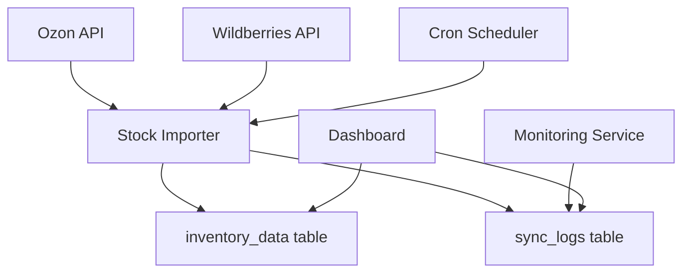

# Design Document

## Overview

Система управления остатками товаров имеет критическую проблему синхронизации данных между API маркетплейсов и локальной базой данных. Основные проблемы:

1. **Несоответствие схемы БД**: Импортер пытается записывать в таблицу `inventory`, но существует только `inventory_data`
2. **Отсутствие автоматизации**: Импортер остатков не запускается по расписанию
3. **Неполные данные**: В БД только тестовые данные, нет реальных остатков с маркетплейсов
4. **Отсутствие мониторинга**: Нет системы отслеживания успешности синхронизации

Решение включает исправление схемы БД, настройку автоматической синхронизации и добавление мониторинга процесса.

## Architecture

### Компоненты системы



### Поток данных

1. **Планировщик (Cron)** запускает импортер каждые 6 часов
2. **Stock Importer** получает данные с API маркетплейсов
3. **Валидация данных** проверяет корректность полученной информации
4. **Обновление БД** сохраняет актуальные остатки в `inventory_data`
5. **Логирование** записывает результаты синхронизации
6. **Мониторинг** отслеживает успешность процесса

## Components and Interfaces

### 1. Database Schema Updates

#### Таблица inventory_data (обновление)

```sql
ALTER TABLE inventory_data
ADD COLUMN warehouse_name VARCHAR(255) DEFAULT 'Main Warehouse',
ADD COLUMN stock_type ENUM('FBO', 'FBS', 'realFBS') DEFAULT 'FBO',
ADD COLUMN quantity_present INT DEFAULT 0,
ADD COLUMN quantity_reserved INT DEFAULT 0,
ADD COLUMN last_sync_at TIMESTAMP DEFAULT CURRENT_TIMESTAMP ON UPDATE CURRENT_TIMESTAMP,
ADD INDEX idx_source_sync (source, last_sync_at),
ADD INDEX idx_product_source (product_id, source);
```

#### Новая таблица sync_logs

```sql
CREATE TABLE sync_logs (
    id INT AUTO_INCREMENT PRIMARY KEY,
    sync_type ENUM('inventory', 'orders', 'transactions') NOT NULL,
    source ENUM('Ozon', 'Wildberries', 'Manual') NOT NULL,
    status ENUM('success', 'partial', 'failed') NOT NULL,
    records_processed INT DEFAULT 0,
    records_updated INT DEFAULT 0,
    error_message TEXT,
    started_at TIMESTAMP NOT NULL,
    completed_at TIMESTAMP,
    duration_seconds INT,
    INDEX idx_sync_type_status (sync_type, status),
    INDEX idx_source_date (source, started_at)
);
```

### 2. Stock Importer Service

#### Класс InventorySyncService

```python
class InventorySyncService:
    def __init__(self):
        self.connection = connect_to_replenishment_db()
        self.logger = logging.getLogger(__name__)

    def sync_ozon_inventory(self) -> SyncResult
    def sync_wb_inventory(self) -> SyncResult
    def validate_inventory_data(self, data: List[Dict]) -> ValidationResult
    def update_inventory_table(self, data: List[Dict]) -> UpdateResult
    def log_sync_result(self, result: SyncResult) -> None
    def get_last_sync_time(self, source: str) -> datetime
    def check_data_freshness(self) -> FreshnessReport
```

#### API интерфейсы

**Ozon Inventory API**

- Endpoint: `/v1/report/products/create` (отчеты)
- Поля остатков: FBO, FBS, realFBS quantities
- Частота обновления: каждые 6 часов

**Wildberries Inventory API**

- Endpoint: `/api/v1/supplier/stocks`
- Поля остатков: quantity, inWayToClient, inWayFromClient
- Частота обновления: каждые 6 часов

### 3. Monitoring and Alerting

#### Класс SyncMonitor

```python
class SyncMonitor:
    def check_sync_health(self) -> HealthStatus
    def detect_data_anomalies(self) -> List[Anomaly]
    def send_alerts(self, issues: List[Issue]) -> None
    def generate_sync_report(self) -> SyncReport
```

#### Метрики мониторинга

- Время последней успешной синхронизации
- Количество товаров с остатками по источникам
- Процент успешных синхронизаций за последние 24 часа
- Среднее время выполнения синхронизации

## Data Models

### InventoryRecord

```python
@dataclass
class InventoryRecord:
    product_id: int
    sku: str
    source: str
    warehouse_name: str
    stock_type: str
    current_stock: int
    reserved_stock: int
    available_stock: int
    snapshot_date: date
    last_sync_at: datetime
```

### SyncResult

```python
@dataclass
class SyncResult:
    source: str
    status: SyncStatus
    records_processed: int
    records_updated: int
    started_at: datetime
    completed_at: datetime
    error_message: Optional[str] = None

    @property
    def duration_seconds(self) -> int:
        return (self.completed_at - self.started_at).total_seconds()
```

### ValidationResult

```python
@dataclass
class ValidationResult:
    is_valid: bool
    total_records: int
    valid_records: int
    errors: List[ValidationError]
    warnings: List[ValidationWarning]
```

## Error Handling

### Типы ошибок и стратегии обработки

1. **API недоступен**

   - Retry с экспоненциальной задержкой (3 попытки)
   - Логирование ошибки
   - Уведомление администратора при повторных сбоях

2. **Неверный формат данных**

   - Пропуск некорректных записей
   - Детальное логирование проблемных данных
   - Продолжение обработки валидных записей

3. **Ошибки БД**

   - Rollback транзакции
   - Повторная попытка через 5 минут
   - Критическое уведомление при повторных сбоях

4. **Превышение лимитов API**
   - Автоматическая задержка согласно rate limits
   - Логирование задержек
   - Адаптивное изменение частоты запросов

### Стратегии восстановления

```python
class RecoveryStrategy:
    def handle_api_timeout(self, source: str) -> None:
        # Увеличить timeout, повторить через 10 минут

    def handle_data_corruption(self, records: List[Dict]) -> None:
        # Очистить поврежденные данные, запросить полную пересинхронизацию

    def handle_partial_sync(self, result: SyncResult) -> None:
        # Запланировать дополнительную синхронизацию для пропущенных записей
```

## Testing Strategy

### Unit Tests

- Тестирование парсинга данных API
- Валидация бизнес-логики синхронизации
- Проверка обработки ошибок

### Integration Tests

- Тестирование подключения к API маркетплейсов
- Проверка записи в БД
- Тестирование полного цикла синхронизации

### End-to-End Tests

- Полная синхронизация с тестовыми данными
- Проверка мониторинга и алертов
- Тестирование восстановления после сбоев

### Performance Tests

- Нагрузочное тестирование с большим объемом данных
- Проверка времени выполнения синхронизации
- Тестирование параллельной обработки

### Test Data Management

```python
class TestDataManager:
    def create_mock_ozon_response(self, num_products: int) -> Dict
    def create_mock_wb_response(self, num_products: int) -> Dict
    def setup_test_database(self) -> None
    def cleanup_test_data(self) -> None
```

## Security Considerations

### API Security

- Безопасное хранение API ключей в переменных окружения
- Ротация ключей каждые 90 дней
- Мониторинг подозрительной активности API

### Database Security

- Использование подготовленных запросов для предотвращения SQL injection
- Ограничение прав доступа для пользователя синхронизации
- Шифрование чувствительных данных

### Logging Security

- Исключение API ключей из логов
- Маскирование персональных данных
- Безопасное хранение логов с ограниченным доступом

## Performance Optimization

### Database Optimization

- Индексы на часто используемые поля (product_id, source, last_sync_at)
- Партиционирование таблицы sync_logs по дате
- Регулярная очистка старых логов (>90 дней)

### API Optimization

- Пакетная обработка запросов
- Кэширование неизменяемых данных
- Сжатие HTTP запросов

### Memory Optimization

- Потоковая обработка больших наборов данных
- Освобождение памяти после обработки каждого батча
- Мониторинг использования памяти

## Deployment Strategy

### Поэтапное развертывание

1. **Фаза 1**: Обновление схемы БД

   - Создание новых полей в inventory_data
   - Создание таблицы sync_logs
   - Миграция существующих данных

2. **Фаза 2**: Развертывание нового импортера

   - Обновление stock_importer_fixed.py
   - Тестирование на staging окружении
   - Постепенный переход с старой системы

3. **Фаза 3**: Настройка автоматизации

   - Настройка cron задач
   - Конфигурация мониторинга
   - Настройка алертов

4. **Фаза 4**: Мониторинг и оптимизация
   - Анализ производительности
   - Настройка параметров синхронизации
   - Документирование процедур

### Rollback Plan

- Сохранение резервной копии БД перед миграцией
- Возможность отключения новой системы через feature flag
- Процедура быстрого возврата к предыдущей версии
