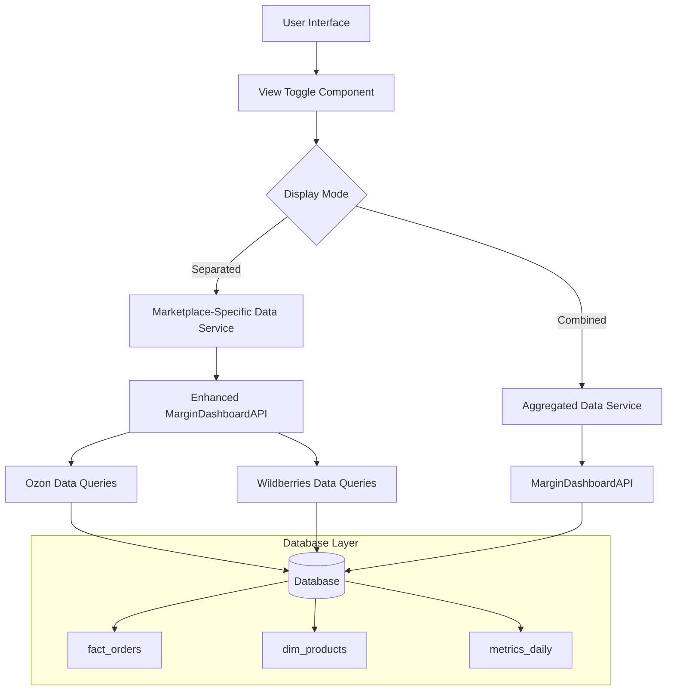

# Design Document

## Overview

Система Manhattan Dashboard в настоящее время отображает агрегированные данные по продажам с маркетплейсов Озон и Валдберис. Данный дизайн описывает архитектуру для разделения данных по маркетплейсам, позволяя пользователям видеть отдельную аналитику по каждой площадке.

Основная задача - модифицировать существующий PHP дашборд для поддержки раздельного отображения данных без нарушения текущей функциональности.

## Architecture

### Current State Analysis

Текущая система использует:

- **База данных**: MySQL с таблицами `fact_orders`, `dim_products`, `metrics_daily`
- **Backend**: PHP классы `MarginDashboardAPI`, `MarginAPI`
- **Frontend**: PHP-генерируемый HTML с JavaScript для интерактивности
- **Идентификация маркетплейсов**: поле `source` в `fact_orders` и поля `sku_ozon`, `sku_wb` в `dim_products`

### Target Architecture



## Components and Interfaces

### 1. Enhanced MarginDashboardAPI Class

Расширение существующего класса для поддержки фильтрации по маркетплейсам:

```php
class MarginDashboardAPI {
    // Новые методы
    public function getMarginSummaryByMarketplace($startDate, $endDate, $marketplace = null, $clientId = null)
    public function getTopProductsByMarketplace($marketplace, $limit = 10, $startDate = null, $endDate = null, $minRevenue = 0)
    public function getDailyMarginChartByMarketplace($startDate, $endDate, $marketplace = null, $clientId = null)
    public function getMarketplaceComparison($startDate, $endDate, $clientId = null)

    // Вспомогательные методы
    private function buildMarketplaceFilter($marketplace)
    private function identifyMarketplace($source, $skuOzon, $skuWb)
}
```

### 2. Marketplace Detection Service

Компонент для определения маркетплейса на основе доступных данных:

```php
class MarketplaceDetector {
    const OZON = 'ozon';
    const WILDBERRIES = 'wildberries';
    const UNKNOWN = 'unknown';

    public static function detectFromSource($source): string
    public static function detectFromSku($skuOzon, $skuWb): string
    public static function getAllMarketplaces(): array
}
```

### 3. Frontend View Toggle Component

JavaScript компонент для переключения между режимами отображения:

```javascript
class MarketplaceViewToggle {
    constructor(containerId, apiEndpoint)
    toggleView(mode) // 'combined' | 'separated'
    refreshData()
    renderCombinedView(data)
    renderSeparatedView(data)
}
```

### 4. Enhanced Dashboard Layout

Модифицированная структура дашборда:

```html
<div class="dashboard-container">
  <div class="view-controls">
    <div class="btn-group" role="group">
      <button
        type="button"
        class="btn btn-outline-primary active"
        data-view="combined"
      >
        Общий вид
      </button>
      <button
        type="button"
        class="btn btn-outline-primary"
        data-view="separated"
      >
        По маркетплейсам
      </button>
    </div>
  </div>

  <div id="combined-view" class="view-container">
    <!-- Текущий дашборд -->
  </div>

  <div id="separated-view" class="view-container" style="display: none;">
    <div class="row">
      <div class="col-md-6">
        <div class="marketplace-section" data-marketplace="ozon">
          <h3>📦 Ozon</h3>
          <!-- KPI блоки для Ozon -->
        </div>
      </div>
      <div class="col-md-6">
        <div class="marketplace-section" data-marketplace="wildberries">
          <h3>🛍️ Wildberries</h3>
          <!-- KPI блоки для Wildberries -->
        </div>
      </div>
    </div>
  </div>
</div>
```

## Data Models

### 1. Marketplace Data Structure

```php
interface MarketplaceData {
    public function getMarketplaceName(): string;
    public function getKPIMetrics(): array;
    public function getTopProducts(): array;
    public function getDailyChart(): array;
    public function getRecommendations(): array;
}

class OzonData implements MarketplaceData { ... }
class WildberriesData implements MarketplaceData { ... }
```

### 2. Enhanced Query Filters

Модификация существующих SQL запросов для поддержки фильтрации:

```sql
-- Базовый фильтр по маркетплейсу
WHERE (
    CASE
        WHEN :marketplace = 'ozon' THEN (
            fo.source LIKE '%ozon%' OR fo.source LIKE '%озон%' OR
            dp.sku_ozon IS NOT NULL AND fo.sku = dp.sku_ozon
        )
        WHEN :marketplace = 'wildberries' THEN (
            fo.source LIKE '%wildberries%' OR fo.source LIKE '%wb%' OR fo.source LIKE '%вб%' OR
            dp.sku_wb IS NOT NULL AND fo.sku = dp.sku_wb
        )
        ELSE 1=1  -- Для общего вида
    END
)
```

### 3. Response Data Format

Стандартизированный формат ответа API:

```json
{
    "success": true,
    "data": {
        "view_mode": "separated",
        "marketplaces": {
            "ozon": {
                "name": "Ozon",
                "kpi": {
                    "revenue": 150000,
                    "orders": 245,
                    "margin_percent": 45.2
                },
                "top_products": [...],
                "daily_chart": [...]
            },
            "wildberries": {
                "name": "Wildberries",
                "kpi": {
                    "revenue": 200000,
                    "orders": 312,
                    "margin_percent": 52.1
                },
                "top_products": [...],
                "daily_chart": [...]
            }
        }
    }
}
```

## Error Handling

### 1. Data Validation

- Проверка корректности параметра `marketplace`
- Валидация дат и периодов
- Обработка случаев отсутствия данных по маркетплейсу

### 2. Fallback Mechanisms

```php
class MarketplaceFallbackHandler {
    public function handleMissingData($marketplace, $period): array
    public function handleUnknownMarketplace($source): string
    public function handleEmptyResults($marketplace): array
}
```

### 3. Error Response Format

```json
{
  "success": false,
  "error": {
    "code": "MARKETPLACE_NOT_FOUND",
    "message": "Данные по указанному маркетплейсу не найдены",
    "details": {
      "marketplace": "ozon",
      "period": "2025-01-01 to 2025-01-31"
    }
  }
}
```

## Testing Strategy

### 1. Unit Tests

- Тестирование `MarketplaceDetector` для корректного определения маркетплейсов
- Тестирование SQL запросов с различными фильтрами
- Тестирование API методов с разными параметрами

### 2. Integration Tests

- Тестирование полного цикла получения данных по маркетплейсам
- Тестирование переключения режимов отображения
- Тестирование обработки ошибок

### 3. Frontend Tests

- Тестирование компонента переключения режимов
- Тестирование корректного отображения данных в разделенном режиме
- Тестирование адаптивности интерфейса

### 4. Performance Tests

- Тестирование производительности запросов с фильтрацией по маркетплейсам
- Сравнение времени отклика в общем и раздельном режимах
- Тестирование с большими объемами данных

## Implementation Considerations

### 1. Database Performance

- Добавление индексов для оптимизации запросов по `source`
- Кэширование результатов для часто запрашиваемых периодов
- Оптимизация JOIN операций с `dim_products`

### 2. Backward Compatibility

- Сохранение всех существующих API методов
- Добавление новых методов без изменения сигнатур существующих
- Поддержка старых URL параметров

### 3. User Experience

- Сохранение выбранного режима просмотра в localStorage
- Плавные переходы между режимами отображения
- Индикаторы загрузки для каждого маркетплейса отдельно

### 4. Data Consistency

- Обеспечение корректной классификации исторических данных
- Обработка случаев, когда товар продается на обеих площадках
- Валидация суммарных показателей (сумма по маркетплейсам = общий показатель)

### 5. Scalability

- Возможность добавления новых маркетплейсов в будущем
- Модульная архитектура для легкого расширения
- Конфигурируемые правила определения маркетплейсов

## Security Considerations

- Валидация всех входных параметров
- Защита от SQL инъекций в новых запросах
- Ограничение доступа к данным по маркетплейсам согласно правам пользователя
- Логирование всех операций с разделенными данными
