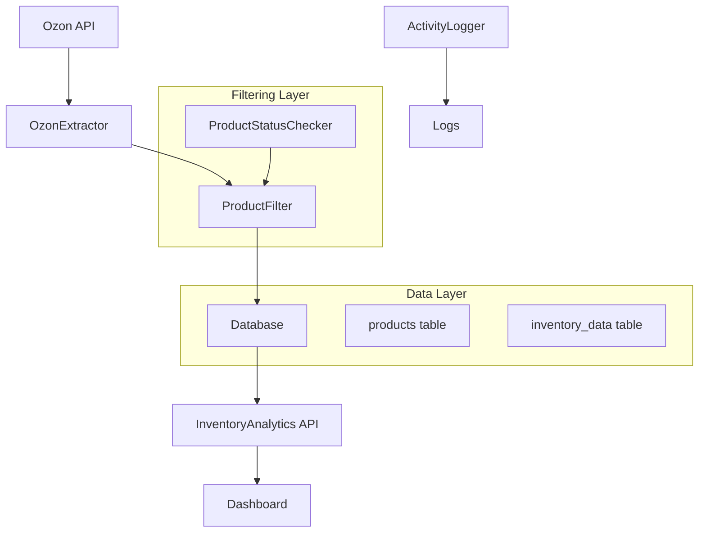

# Design Document

## Overview

Система оптимизации фильтрации товаров Ozon предназначена для работы только с активными товарами в продаже, исключая неактивные товары из всех расчетов и отображения в дашборде. Это позволит снизить нагрузку на систему и повысить релевантность данных.

Текущая проблема: система обрабатывает все 176 товаров, включая неактивные, что приводит к неэффективному использованию ресурсов и засорению дашборда.

Целевое решение: фильтрация на уровне API запросов и базы данных для работы только с 48 активными товарами.

## Architecture

### Компоненты системы



### Уровни фильтрации

1. **API Level Filtering** - фильтрация на уровне запросов к Ozon API
2. **Data Processing Level** - дополнительная фильтрация при обработке данных
3. **Database Level** - фильтрация в SQL запросах дашборда
4. **Application Level** - финальная фильтрация в API endpoints

## Components and Interfaces

### 1. Enhanced OzonExtractor

**Назначение:** Расширение существующего OzonExtractor для поддержки фильтрации активных товаров

**Ключевые изменения:**

- Добавление фильтра `visibility: "VISIBLE"` в запросы `/v2/product/list`
- Интеграция проверки статуса товаров через `/v2/product/info/list`
- Проверка остатков через `/v3/product/info/stocks`

**Интерфейс:**

```php
interface ActiveProductFilterInterface
{
    public function fetchActiveProducts(array $filters = []): array;
    public function checkProductActivity(array $product): bool;
    public function updateProductActivityStatus(string $productId, bool $isActive): void;
}
```

### 2. ProductActivityChecker

**Назначение:** Определение активности товаров на основе комбинированных критериев

**Критерии активности:**

- `visibility = "VISIBLE"`
- `state = "processed"`
- `present > 0` (остатки)
- Цена установлена

**Методы:**

```php
class ProductActivityChecker
{
    public function isProductActive(array $productData, array $stockData, array $priceData): bool;
    public function getActivityReason(array $productData): string;
    public function batchCheckActivity(array $products): array;
}
```

### 3. Database Schema Updates

**Новые поля в таблице products:**

```sql
ALTER TABLE products ADD COLUMN is_active BOOLEAN DEFAULT FALSE;
ALTER TABLE products ADD COLUMN activity_checked_at TIMESTAMP NULL;
ALTER TABLE products ADD COLUMN activity_reason VARCHAR(255) NULL;
ALTER TABLE products ADD INDEX idx_is_active (is_active);
```

**Новая таблица для логирования изменений активности:**

```sql
CREATE TABLE product_activity_log (
    id INT PRIMARY KEY AUTO_INCREMENT,
    product_id VARCHAR(255) NOT NULL,
    external_sku VARCHAR(255) NOT NULL,
    previous_status BOOLEAN,
    new_status BOOLEAN,
    reason VARCHAR(255),
    changed_at TIMESTAMP DEFAULT CURRENT_TIMESTAMP,
    INDEX idx_product_id (product_id),
    INDEX idx_changed_at (changed_at)
);
```

### 4. Enhanced Inventory Analytics API

**Модификация существующих endpoints:**

- Добавление параметра `active_only=true` (по умолчанию)
- Фильтрация всех запросов по `is_active = 1`
- Добавление статистики по активным/неактивным товарам

**Новые endpoints:**

```php
GET /api/inventory-analytics.php?action=activity_stats
GET /api/inventory-analytics.php?action=inactive_products
GET /api/inventory-analytics.php?action=activity_changes&date_from=X&date_to=Y
```

## Data Models

### ProductActivity Model

```php
class ProductActivity
{
    public string $productId;
    public string $externalSku;
    public bool $isActive;
    public string $activityReason;
    public DateTime $checkedAt;
    public array $criteria;

    // Критерии активности
    public bool $isVisible;      // visibility = "VISIBLE"
    public bool $isProcessed;    // state = "processed"
    public bool $hasStock;       // present > 0
    public bool $hasPricing;     // цена установлена
}
```

### ActivityChangeLog Model

```php
class ActivityChangeLog
{
    public int $id;
    public string $productId;
    public string $externalSku;
    public ?bool $previousStatus;
    public bool $newStatus;
    public string $reason;
    public DateTime $changedAt;
}
```

## Error Handling

### API Error Scenarios

1. **Ozon API недоступен**

   - Fallback: использовать кэшированные данные активности
   - Логирование: WARNING level
   - Retry: экспоненциальная задержка

2. **Ошибка определения активности товара**

   - Fallback: считать товар неактивным
   - Логирование: ERROR level с деталями
   - Продолжение обработки других товаров

3. **Ошибка обновления статуса в БД**
   - Rollback транзакции
   - Логирование: CRITICAL level
   - Уведомление администратора

### Data Consistency

```php
class ActivityUpdateTransaction
{
    public function updateProductActivity(array $products): bool
    {
        $this->pdo->beginTransaction();

        try {
            foreach ($products as $product) {
                $this->updateSingleProduct($product);
                $this->logActivityChange($product);
            }

            $this->pdo->commit();
            return true;

        } catch (Exception $e) {
            $this->pdo->rollback();
            $this->logger->critical('Activity update failed', ['error' => $e->getMessage()]);
            throw $e;
        }
    }
}
```

## Testing Strategy

### Unit Tests

1. **ProductActivityChecker Tests**

   - Тестирование различных комбинаций критериев активности
   - Граничные случаи (нулевые остатки, отсутствие цены)
   - Валидация логики определения активности

2. **OzonExtractor Filter Tests**

   - Проверка корректности фильтров API
   - Тестирование пагинации с фильтрами
   - Обработка ошибок API

3. **Database Integration Tests**
   - Тестирование обновления статуса активности
   - Проверка индексов и производительности
   - Тестирование транзакций

### Integration Tests

1. **End-to-End ETL Process**

   - Полный цикл: API → фильтрация → БД → дашборд
   - Проверка корректности подсчетов
   - Тестирование с реальными данными Ozon

2. **Dashboard API Tests**
   - Проверка фильтрации в API endpoints
   - Сравнение результатов до/после фильтрации
   - Тестирование новых endpoints активности

### Performance Tests

1. **Database Query Performance**

   - Измерение времени выполнения запросов с фильтрацией
   - Проверка эффективности индексов
   - Нагрузочное тестирование

2. **API Response Time**
   - Измерение времени ответа дашборда
   - Сравнение производительности до/после оптимизации
   - Тестирование с различными объемами данных

## Implementation Phases

### Phase 1: Core Infrastructure

- Обновление схемы БД
- Создание ProductActivityChecker
- Базовая интеграция с OzonExtractor

### Phase 2: API Integration

- Модификация OzonExtractor для фильтрации
- Интеграция проверки остатков и цен
- Логирование изменений активности

### Phase 3: Dashboard Updates

- Обновление Inventory Analytics API
- Добавление фильтрации в существующие endpoints
- Создание новых endpoints для мониторинга активности

### Phase 4: Monitoring & Optimization

- Добавление метрик производительности
- Настройка уведомлений об изменениях
- Оптимизация запросов и индексов

## Configuration

### Environment Variables

```env
# Фильтрация товаров
OZON_FILTER_ACTIVE_ONLY=true
OZON_ACTIVITY_CHECK_INTERVAL=3600  # секунды
OZON_STOCK_THRESHOLD=0             # минимальные остатки

# Логирование
ACTIVITY_LOG_RETENTION_DAYS=90
ACTIVITY_CHANGE_NOTIFICATIONS=true

# Производительность
BATCH_SIZE_ACTIVITY_CHECK=100
MAX_CONCURRENT_REQUESTS=5
```

### Database Configuration

```sql
-- Оптимизация для фильтрации активных товаров
SET SESSION sql_mode = 'STRICT_TRANS_TABLES,NO_ZERO_DATE,NO_ZERO_IN_DATE,ERROR_FOR_DIVISION_BY_ZERO';

-- Индексы для производительности
CREATE INDEX idx_products_active_updated ON products(is_active, updated_at);
CREATE INDEX idx_inventory_active_products ON inventory_data(product_id) WHERE EXISTS (
    SELECT 1 FROM products p WHERE p.id = inventory_data.product_id AND p.is_active = 1
);
```
