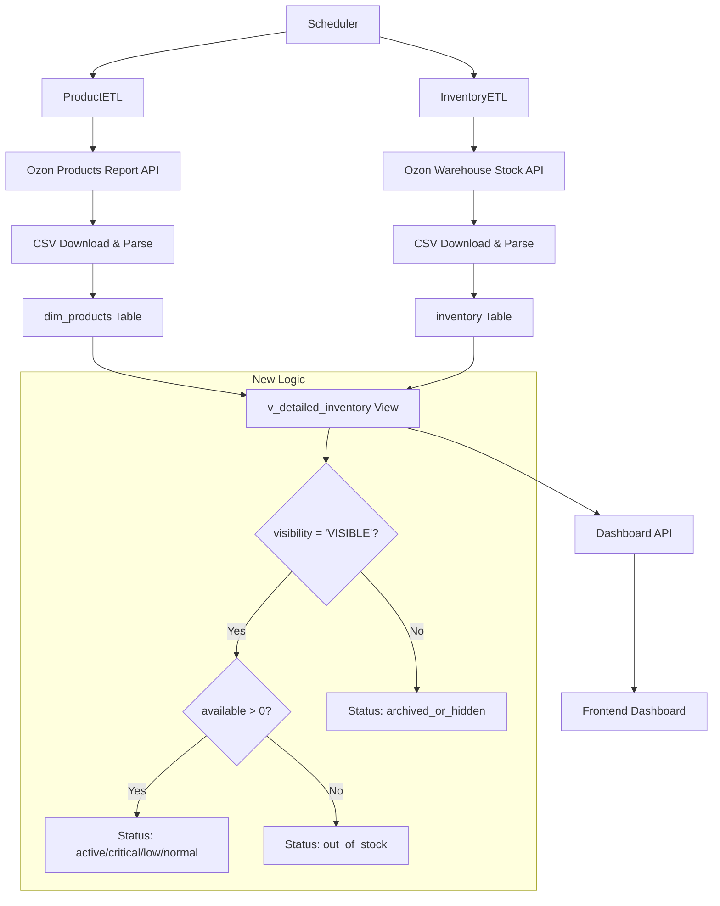

# Design Document

## Overview

Данный документ описывает архитектурное решение для рефакторинга ETL-системы Ozon с целью получения достоверных данных об остатках товаров. Основная проблема заключается в том, что текущая система использует только отчет `warehouse/stock`, который не отражает реальное состояние товаров "В продаже".

Решение предполагает переход к двухкомпонентной системе сбора данных:

1. **Статус видимости товара** из отчета `/v1/report/products/create`
2. **Количественные остатки** из отчета `/v1/report/warehouse/stock`

Финальная метрика "В продаже" будет вычисляться как комбинация этих двух источников данных.

## Architecture

### Current Architecture Analysis

Существующая система состоит из следующих компонентов:

```
┌─────────────────┐    ┌──────────────────┐    ┌─────────────────┐
│   ProductETL    │    │   InventoryETL   │    │ v_detailed_     │
│                 │    │                  │    │ inventory       │
│ /v2/product/    │    │ /v1/report/      │    │                 │
│ list            │    │ warehouse/stock  │    │ Business Logic  │
│                 │    │                  │    │ View            │
└─────────────────┘    └──────────────────┘    └─────────────────┘
         │                       │                       │
         ▼                       ▼                       ▼
┌─────────────────┐    ┌──────────────────┐    ┌─────────────────┐
│  dim_products   │    │    inventory     │    │   Dashboard     │
│                 │    │                  │    │     API         │
│ - product_id    │    │ - offer_id       │    │                 │
│ - offer_id      │    │ - warehouse_name │    │ /api/inventory/ │
│ - name          │    │ - present        │    │ detailed-stock  │
│ - fbo_sku       │    │ - reserved       │    │                 │
│ - fbs_sku       │    │                  │    │                 │
│ - status        │    │                  │    │                 │
└─────────────────┘    └──────────────────┘    └─────────────────┘
```

### Target Architecture

Новая архитектура с двухкомпонентной системой:

```
┌─────────────────┐    ┌──────────────────┐    ┌─────────────────┐
│   ProductETL    │    │   InventoryETL   │    │ v_detailed_     │
│   (Enhanced)    │    │   (Focused)      │    │ inventory       │
│                 │    │                  │    │ (Enhanced)      │
│ /v1/report/     │    │ /v1/report/      │    │                 │
│ products/create │    │ warehouse/stock  │    │ Combined Logic  │
│                 │    │                  │    │ View            │
└─────────────────┘    └──────────────────┘    └─────────────────┘
         │                       │                       │
         ▼                       ▼                       ▼
┌─────────────────┐    ┌──────────────────┐    ┌─────────────────┐
│  dim_products   │    │    inventory     │    │   Dashboard     │
│   (Enhanced)    │    │   (Unchanged)    │    │     API         │
│                 │    │                  │    │   (Enhanced)    │
│ - product_id    │    │ - offer_id       │    │                 │
│ - offer_id      │    │ - warehouse_name │    │ /api/inventory/ │
│ - name          │    │ - present        │    │ detailed-stock  │
│ - fbo_sku       │    │ - reserved       │    │                 │
│ - fbs_sku       │    │ - available      │    │ Filters by      │
│ - status        │    │                  │    │ stock_status    │
│ + visibility    │◄───┼──────────────────┼────┤                 │
│                 │    │                  │    │                 │
└─────────────────┘    └──────────────────┘    └─────────────────┘
```

### Data Flow



## Components and Interfaces

### 1. Enhanced ProductETL Component

**Responsibilities:**

-   Получение данных о видимости товаров из отчета `/v1/report/products/create`
-   Обновление поля `visibility` в таблице `dim_products`
-   Сохранение существующей функциональности по обработке справочника товаров

**Key Changes:**

```php
class ProductETL extends BaseETL
{
    // Изменение API endpoint
    public function extract(): array
    {
        // Вместо: $this->apiClient->getProducts()
        // Использовать: $this->apiClient->createProductsReport()
        $reportCode = $this->apiClient->createProductsReport();
        $statusResponse = $this->waitForReportCompletion($reportCode);
        return $this->downloadAndParseCsv($statusResponse['result']['file']);
    }

    // Обновление трансформации для парсинга CSV
    public function transform(array $data): array
    {
        // Парсинг CSV вместо JSON
        // Извлечение поля visibility из CSV
        // Маппинг статусов видимости
    }

    // Обновление загрузки для поля visibility
    public function load(array $data): void
    {
        // Добавление поля visibility в upsert логику
    }
}
```

**Interface Changes:**

-   **Input:** CSV отчет вместо JSON API response
-   **Output:** Дополнительное поле `visibility` в `dim_products`

### 2. Focused InventoryETL Component

**Responsibilities:**

-   Сосредоточение только на количественных данных остатков
-   Упрощение логики за счет удаления ответственности за статусы товаров
-   Сохранение существующей логики полного обновления таблицы

**Key Changes:**

```php
class InventoryETL extends BaseETL
{
    // Логика extract() остается без изменений
    // Логика transform() упрощается - фокус только на количествах
    // Логика load() остается без изменений (TRUNCATE + INSERT)
}
```

**Interface Changes:**

-   **Input:** Без изменений (CSV отчет warehouse/stock)
-   **Output:** Без изменений (таблица inventory)

### 3. Enhanced Database Schema

**New Field in dim_products:**

```sql
ALTER TABLE dim_products ADD COLUMN visibility VARCHAR(50);
CREATE INDEX idx_dim_products_visibility ON dim_products(visibility);
```

**Visibility Values Mapping:**

-   `VISIBLE` / `ACTIVE` / `продаётся` → товар видим в каталоге
-   `INACTIVE` / `ARCHIVED` / `скрыт` → товар скрыт
-   `MODERATION` / `на модерации` → товар на модерации
-   `DECLINED` / `отклонён` → товар отклонён

### 4. Enhanced v_detailed_inventory View

**New Business Logic:**

```sql
CREATE OR REPLACE VIEW v_detailed_inventory AS
SELECT
    -- ... (существующие поля) ...
    p.visibility,
    i.present,
    i.reserved,
    (i.present - i.reserved) AS available_stock,

    -- Новая логика расчета stock_status
    CASE
        WHEN p.visibility NOT IN ('VISIBLE', 'ACTIVE', 'продаётся') THEN 'archived_or_hidden'
        WHEN (i.present - i.reserved) <= 0 THEN 'out_of_stock'
        WHEN ((i.present - i.reserved) / NULLIF(wsm.daily_sales_avg, 0)) < 14 THEN 'critical'
        WHEN ((i.present - i.reserved) / NULLIF(wsm.daily_sales_avg, 0)) < 30 THEN 'low'
        WHEN ((i.present - i.reserved) / NULLIF(wsm.daily_sales_avg, 0)) < 60 THEN 'normal'
        ELSE 'excess'
    END as stock_status,

    -- ... (остальные расчеты) ...
FROM inventory i
LEFT JOIN dim_products p ON i.offer_id = p.offer_id
LEFT JOIN warehouse_sales_metrics wsm ON ...
WHERE p.visibility IN ('VISIBLE', 'ACTIVE', 'продаётся')  -- Фильтр по умолчанию
  AND (i.present - i.reserved) > 0;  -- Фильтр по доступному остатку
```

### 5. Enhanced API Endpoint

**Updated Filtering Logic:**

```php
class DetailedStockAPI
{
    public function getDetailedStock(array $filters = []): array
    {
        $sql = "SELECT * FROM v_detailed_inventory WHERE 1=1";

        // По умолчанию исключаем скрытые и товары без остатков
        if (!isset($filters['include_hidden'])) {
            $sql .= " AND stock_status NOT IN ('archived_or_hidden', 'out_of_stock')";
        }

        // Дополнительные фильтры...

        return $this->db->query($sql, $params);
    }
}
```

## Data Models

### Enhanced dim_products Table

```sql
CREATE TABLE dim_products (
    id SERIAL PRIMARY KEY,
    product_id BIGINT NOT NULL,
    offer_id VARCHAR(255) UNIQUE NOT NULL,
    name VARCHAR(1000),
    fbo_sku VARCHAR(255),
    fbs_sku VARCHAR(255),
    status VARCHAR(50) DEFAULT 'unknown',
    visibility VARCHAR(50),  -- NEW FIELD
    created_at TIMESTAMP DEFAULT CURRENT_TIMESTAMP,
    updated_at TIMESTAMP DEFAULT CURRENT_TIMESTAMP
);

CREATE INDEX idx_dim_products_visibility ON dim_products(visibility);
CREATE INDEX idx_dim_products_offer_id ON dim_products(offer_id);
```

### inventory Table (Unchanged)

```sql
CREATE TABLE inventory (
    id SERIAL PRIMARY KEY,
    offer_id VARCHAR(255) NOT NULL,
    warehouse_name VARCHAR(255) NOT NULL,
    item_name VARCHAR(1000),
    present INTEGER DEFAULT 0,
    reserved INTEGER DEFAULT 0,
    available INTEGER GENERATED ALWAYS AS (present - reserved) STORED,
    updated_at TIMESTAMP DEFAULT CURRENT_TIMESTAMP,

    UNIQUE(offer_id, warehouse_name)
);
```

### Enhanced v_detailed_inventory View Schema

```sql
-- Основные поля
product_id BIGINT,
product_name VARCHAR(1000),
offer_id VARCHAR(255),
visibility VARCHAR(50),  -- NEW FIELD

-- Количественные данные
present INTEGER,
reserved INTEGER,
available_stock INTEGER,  -- Calculated: present - reserved

-- Статус товара (новая логика)
stock_status VARCHAR(50),  -- 'archived_or_hidden', 'out_of_stock', 'critical', 'low', 'normal', 'excess'

-- Аналитические данные
daily_sales_avg DECIMAL(10,2),
days_of_stock DECIMAL(10,1),
recommended_qty INTEGER,
urgency_score INTEGER
```

## Error Handling

### 1. ProductETL Error Scenarios

**CSV Format Changes:**

```php
private function validateProductsCsvStructure(array $csvData): void
{
    $requiredHeaders = ['offer_id', 'product_id', 'name', 'status', 'visibility'];

    if (!$this->hasRequiredHeaders($csvData, $requiredHeaders)) {
        throw new RuntimeException('Products CSV missing required headers');
    }
}
```

**Visibility Status Mapping:**

```php
private function normalizeVisibilityStatus(?string $rawStatus): string
{
    $statusMap = [
        'VISIBLE' => 'VISIBLE',
        'ACTIVE' => 'VISIBLE',
        'продаётся' => 'VISIBLE',
        'INACTIVE' => 'HIDDEN',
        'ARCHIVED' => 'HIDDEN',
        'скрыт' => 'HIDDEN',
        'MODERATION' => 'MODERATION',
        'на модерации' => 'MODERATION'
    ];

    return $statusMap[strtoupper(trim($rawStatus ?? ''))] ?? 'UNKNOWN';
}
```

### 2. Data Consistency Checks

**Cross-Reference Validation:**

```php
private function validateDataConsistency(): array
{
    // Проверка товаров без visibility
    $productsWithoutVisibility = $this->db->query(
        "SELECT COUNT(*) as count FROM dim_products WHERE visibility IS NULL"
    );

    // Проверка остатков без товаров
    $inventoryWithoutProducts = $this->db->query(
        "SELECT COUNT(*) as count FROM inventory i
         LEFT JOIN dim_products p ON i.offer_id = p.offer_id
         WHERE p.offer_id IS NULL"
    );

    return [
        'products_without_visibility' => $productsWithoutVisibility[0]['count'],
        'inventory_without_products' => $inventoryWithoutProducts[0]['count']
    ];
}
```

### 3. Rollback Strategies

**Transaction Management:**

```php
public function executeETLWithRollback(): void
{
    $this->db->beginTransaction();

    try {
        // Backup current state
        $backupInfo = $this->createDataBackup();

        // Execute ProductETL
        $this->productETL->run();

        // Execute InventoryETL
        $this->inventoryETL->run();

        // Validate results
        $validation = $this->validateResults();

        if ($validation['success']) {
            $this->db->commit();
        } else {
            throw new RuntimeException('Validation failed: ' . $validation['error']);
        }

    } catch (Exception $e) {
        $this->db->rollback();
        $this->restoreFromBackup($backupInfo);
        throw $e;
    }
}
```

## Testing Strategy

### 1. Unit Tests

**ProductETL Tests:**

```php
class ProductETLTest extends PHPUnit\Framework\TestCase
{
    public function testVisibilityStatusMapping(): void
    {
        $productETL = new ProductETL($this->mockDb, $this->mockLogger, $this->mockApi);

        $testCases = [
            ['VISIBLE', 'VISIBLE'],
            ['продаётся', 'VISIBLE'],
            ['INACTIVE', 'HIDDEN'],
            ['скрыт', 'HIDDEN'],
            ['unknown_status', 'UNKNOWN']
        ];

        foreach ($testCases as [$input, $expected]) {
            $result = $productETL->normalizeVisibilityStatus($input);
            $this->assertEquals($expected, $result);
        }
    }

    public function testCsvParsingWithVisibility(): void
    {
        $csvData = [
            ['offer_id' => 'TEST001', 'visibility' => 'VISIBLE', 'product_id' => '123'],
            ['offer_id' => 'TEST002', 'visibility' => 'INACTIVE', 'product_id' => '124']
        ];

        $result = $this->productETL->transform($csvData);

        $this->assertEquals('VISIBLE', $result[0]['visibility']);
        $this->assertEquals('HIDDEN', $result[1]['visibility']);
    }
}
```

### 2. Integration Tests

**End-to-End ETL Test:**

```php
class ETLIntegrationTest extends PHPUnit\Framework\TestCase
{
    public function testCompleteETLWorkflow(): void
    {
        // Setup test data
        $this->setupTestDatabase();

        // Run ProductETL
        $productETL = new ProductETL($this->db, $this->logger, $this->mockApi);
        $productETL->run();

        // Run InventoryETL
        $inventoryETL = new InventoryETL($this->db, $this->logger, $this->mockApi);
        $inventoryETL->run();

        // Verify v_detailed_inventory
        $result = $this->db->query("SELECT * FROM v_detailed_inventory WHERE stock_status != 'archived_or_hidden'");

        $this->assertGreaterThan(0, count($result));
        $this->assertArrayHasKey('visibility', $result[0]);
        $this->assertArrayHasKey('available_stock', $result[0]);
    }
}
```

### 3. Data Quality Tests

**Business Logic Validation:**

```php
class BusinessLogicTest extends PHPUnit\Framework\TestCase
{
    public function testStockStatusCalculation(): void
    {
        $testCases = [
            // [visibility, present, reserved, daily_sales, expected_status]
            ['VISIBLE', 100, 10, 5, 'normal'],      // 90/5 = 18 days
            ['VISIBLE', 50, 10, 5, 'critical'],     // 40/5 = 8 days
            ['VISIBLE', 10, 10, 5, 'out_of_stock'], // 0 available
            ['HIDDEN', 100, 10, 5, 'archived_or_hidden'], // Hidden product
        ];

        foreach ($testCases as [$visibility, $present, $reserved, $dailySales, $expected]) {
            $result = $this->calculateStockStatus($visibility, $present, $reserved, $dailySales);
            $this->assertEquals($expected, $result);
        }
    }
}
```

### 4. Performance Tests

**Load Testing:**

```php
class PerformanceTest extends PHPUnit\Framework\TestCase
{
    public function testLargeDatasetProcessing(): void
    {
        $startTime = microtime(true);

        // Process 10,000 products
        $this->processLargeDataset(10000);

        $duration = microtime(true) - $startTime;

        // Should complete within 60 seconds
        $this->assertLessThan(60, $duration);
    }

    public function testViewPerformance(): void
    {
        $startTime = microtime(true);

        $result = $this->db->query("SELECT * FROM v_detailed_inventory LIMIT 1000");

        $duration = microtime(true) - $startTime;

        // Should complete within 2 seconds
        $this->assertLessThan(2, $duration);
    }
}
```

## Implementation Phases

### Phase 1: Database Schema Updates

1. Добавление поля `visibility` в `dim_products`
2. Создание индекса для оптимизации запросов
3. Миграция существующих данных

### Phase 2: ProductETL Refactoring

1. Изменение API endpoint на отчетный
2. Реализация CSV парсинга вместо JSON
3. Добавление логики обработки visibility
4. Обновление unit тестов

### Phase 3: View Logic Enhancement

1. Обновление `v_detailed_inventory` с новой бизнес-логикой
2. Тестирование производительности
3. Валидация результатов

### Phase 4: API and Frontend Updates

1. Обновление API endpoint для поддержки новых фильтров
2. Тестирование интеграции с фронтендом
3. Обновление документации

### Phase 5: Scheduler and Monitoring

1. Обновление cron заданий для правильной последовательности
2. Добавление мониторинга новых метрик
3. Настройка алертов

### Phase 6: Validation and Rollout

1. Сравнение результатов с эталонными данными Ozon
2. A/B тестирование с существующей системой
3. Постепенный переход на новую логику
