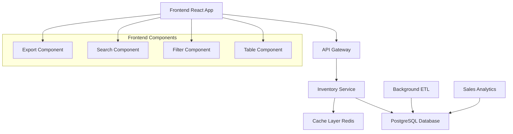

# Design Document: Warehouse Dashboard Redesign

## Overview

This design document outlines the complete redesign of the warehouse monitoring dashboard, transitioning from aggregated warehouse-level data to detailed product-level insights. The new dashboard will provide inventory managers with actionable, granular data to make informed decisions about specific SKUs on specific warehouses.

### Key Design Principles

1. **Product-Centric View**: Every data point relates to a specific product on a specific warehouse
2. **Actionable Insights**: Data presentation focuses on enabling immediate decision-making
3. **Performance First**: Optimized for handling large datasets with responsive interactions
4. **Progressive Enhancement**: Core functionality works without JavaScript, enhanced with interactive features

## Architecture

### System Architecture



### Data Flow Architecture

1. **ETL Pipeline**: Existing warehouse and sales data processing
2. **API Layer**: New detailed inventory endpoint with pre-calculated metrics
3. **Frontend**: React-based table interface with real-time filtering and sorting
4. **Caching**: Redis for frequently accessed calculations

## Components and Interfaces

### Frontend Components

#### 1. Main Dashboard Container (`WarehouseDashboard.tsx`)

-   **Purpose**: Root component managing state and data fetching
-   **Props**: None (root component)
-   **State**:
    -   `inventoryData: ProductWarehouseItem[]`
    -   `filters: FilterState`
    -   `sortConfig: SortConfig`
    -   `loading: boolean`

#### 2. Inventory Table (`InventoryTable.tsx`)

-   **Purpose**: Core table displaying product-warehouse pairs
-   **Props**:
    -   `data: ProductWarehouseItem[]`
    -   `sortConfig: SortConfig`
    -   `onSort: (column: string) => void`
-   **Features**:
    -   Sortable columns
    -   Virtual scrolling for performance
    -   Row selection for bulk actions

#### 3. Filter Panel (`FilterPanel.tsx`)

-   **Purpose**: Controls for filtering and searching data
-   **Props**:
    -   `filters: FilterState`
    -   `onFilterChange: (filters: FilterState) => void`
    -   `warehouses: string[]`
-   **Features**:
    -   Multi-select warehouse filter
    -   Status level filter (Critical, Low, Normal, Excess)
    -   Product search with debouncing

#### 4. Status Indicator (`StatusIndicator.tsx`)

-   **Purpose**: Visual status representation
-   **Props**:
    -   `status: 'critical' | 'low' | 'normal' | 'excess'`
    -   `daysOfStock: number`
-   **Features**:
    -   Color-coded indicators
    -   Tooltip with detailed information

#### 5. Export Controls (`ExportControls.tsx`)

-   **Purpose**: Data export functionality
-   **Props**:
    -   `data: ProductWarehouseItem[]`
    -   `filters: FilterState`
-   **Features**:
    -   Excel export
    -   CSV export
    -   Procurement order generation

### Backend API Design

#### New Endpoint: `/api/inventory/detailed-stock`

**Request Parameters:**

```typescript
interface DetailedStockRequest {
    warehouses?: string[]; // Filter by specific warehouses
    status?: string[]; // Filter by status levels
    search?: string; // Product name/SKU search
    sortBy?: string; // Sort column
    sortOrder?: "asc" | "desc"; // Sort direction
    limit?: number; // Pagination limit
    offset?: number; // Pagination offset
}
```

**Response Format:**

```typescript
interface DetailedStockResponse {
    success: boolean;
    data: ProductWarehouseItem[];
    metadata: {
        totalCount: number;
        filteredCount: number;
        timestamp: string;
        processingTime: number;
    };
}

interface ProductWarehouseItem {
    productId: number;
    productName: string;
    sku: string;
    warehouseName: string;
    currentStock: number;
    dailySales: number; // ADS - Average Daily Sales
    sales28d: number; // Sales last 28 days
    daysOfStock: number; // Current stock / ADS
    status: "critical" | "low" | "normal" | "excess";
    recommendedQty: number; // Calculated replenishment quantity
    estimatedValue: number; // Recommended qty * unit cost
    lastSaleDate: string | null;
    stockoutRisk: number; // 0-100 risk score
}
```

## Data Models

### Core Data Structures

#### ProductWarehouseItem

```typescript
interface ProductWarehouseItem {
    // Identifiers
    productId: number;
    productName: string;
    sku: string;
    warehouseName: string;

    // Stock Information
    currentStock: number;
    reservedStock: number;
    availableStock: number;

    // Sales Metrics
    dailySales: number; // Average daily sales
    sales7d: number; // Sales last 7 days
    sales28d: number; // Sales last 28 days
    salesTrend: "up" | "down" | "stable";

    // Calculated Metrics
    daysOfStock: number; // Days until stockout
    monthsOfStock: number; // Months of stock
    turnoverRate: number; // Annual turnover rate

    // Status and Recommendations
    status: StockStatus;
    recommendedQty: number;
    recommendedValue: number;
    urgencyScore: number; // 0-100 priority score

    // Metadata
    lastUpdated: string;
    lastSaleDate: string | null;
    stockoutRisk: number;
}
```

#### FilterState

```typescript
interface FilterState {
    warehouses: string[];
    statuses: StockStatus[];
    searchTerm: string;
    showOnlyUrgent: boolean;
    minDaysOfStock?: number;
    maxDaysOfStock?: number;
}
```

#### SortConfig

```typescript
interface SortConfig {
    column: keyof ProductWarehouseItem;
    direction: "asc" | "desc";
}
```

### Database Schema Updates

#### New Calculated View: `v_detailed_inventory`

```sql
CREATE OR REPLACE VIEW v_detailed_inventory AS
SELECT
    i.product_id,
    p.product_name,
    p.sku,
    i.warehouse_name,

    -- Stock calculations
    (COALESCE(i.quantity_present, 0) +
     COALESCE(i.quantity_reserved, 0) +
     COALESCE(i.preparing_for_sale, 0)) as current_stock,

    -- Sales metrics from warehouse_sales_metrics
    wsm.daily_sales_avg,
    wsm.sales_last_7_days,
    wsm.sales_last_28_days,

    -- Calculated metrics
    CASE
        WHEN wsm.daily_sales_avg > 0 THEN
            ROUND((COALESCE(i.quantity_present, 0) +
                   COALESCE(i.quantity_reserved, 0) +
                   COALESCE(i.preparing_for_sale, 0)) / wsm.daily_sales_avg, 1)
        ELSE NULL
    END as days_of_stock,

    -- Status calculation
    CASE
        WHEN wsm.daily_sales_avg = 0 THEN 'no_sales'
        WHEN (current_stock / wsm.daily_sales_avg) < 14 THEN 'critical'
        WHEN (current_stock / wsm.daily_sales_avg) < 30 THEN 'low'
        WHEN (current_stock / wsm.daily_sales_avg) < 60 THEN 'normal'
        ELSE 'excess'
    END as stock_status,

    -- Replenishment calculation
    GREATEST(0,
        ROUND(wsm.daily_sales_avg * 60, 0) - current_stock
    ) as recommended_qty,

    i.last_updated
FROM inventory i
LEFT JOIN products p ON i.product_id = p.id
LEFT JOIN warehouse_sales_metrics wsm ON i.product_id = wsm.product_id
    AND i.warehouse_name = wsm.warehouse_name;
```

## Error Handling

### Frontend Error Handling

1. **API Errors**: Graceful degradation with error messages
2. **Network Issues**: Retry mechanism with exponential backoff
3. **Data Validation**: Client-side validation before API calls
4. **Loading States**: Skeleton screens during data fetching

### Backend Error Handling

1. **Database Errors**: Proper error logging and user-friendly messages
2. **Performance Issues**: Query timeouts and fallback responses
3. **Data Integrity**: Validation of calculated metrics
4. **Rate Limiting**: Protection against excessive API calls

### Error Response Format

```typescript
interface ErrorResponse {
    success: false;
    error: {
        code: string;
        message: string;
        details?: any;
    };
    timestamp: string;
}
```

## Testing Strategy

### Unit Testing

-   **Frontend Components**: Jest + React Testing Library
-   **API Endpoints**: PHPUnit for backend logic
-   **Utility Functions**: Comprehensive test coverage for calculations

### Integration Testing

-   **API Integration**: Full request/response cycle testing
-   **Database Queries**: Performance and accuracy testing
-   **Filter Combinations**: Complex filter scenario testing

### Performance Testing

-   **Large Dataset Handling**: Test with 10,000+ product-warehouse pairs
-   **API Response Times**: Target < 500ms for filtered queries
-   **Frontend Rendering**: Virtual scrolling performance validation

### User Acceptance Testing

-   **Manager Workflows**: Real-world usage scenarios
-   **Filter Usability**: Intuitive filter combinations
-   **Export Functionality**: Complete procurement workflow testing

## Performance Considerations

### Frontend Optimization

1. **Virtual Scrolling**: Handle large datasets efficiently
2. **Debounced Search**: Reduce API calls during typing
3. **Memoization**: Cache expensive calculations
4. **Code Splitting**: Lazy load components

### Backend Optimization

1. **Database Indexing**: Optimize queries for filtering and sorting
2. **Caching Strategy**: Redis for frequently accessed calculations
3. **Query Optimization**: Efficient joins and aggregations
4. **Pagination**: Limit response sizes

### Caching Strategy

```typescript
// Cache keys for different data types
const CACHE_KEYS = {
    DETAILED_INVENTORY: "inventory:detailed:v1",
    WAREHOUSE_LIST: "warehouses:active:v1",
    PRODUCT_SEARCH: "products:search:v1",
};

// Cache TTL (Time To Live)
const CACHE_TTL = {
    INVENTORY_DATA: 300, // 5 minutes
    WAREHOUSE_LIST: 3600, // 1 hour
    SEARCH_RESULTS: 1800, // 30 minutes
};
```

## Security Considerations

### API Security

1. **Authentication**: Existing user authentication system
2. **Authorization**: Role-based access to warehouse data
3. **Input Validation**: Sanitize all user inputs
4. **Rate Limiting**: Prevent API abuse

### Data Privacy

1. **Sensitive Data**: No exposure of cost/pricing information in frontend
2. **Audit Logging**: Track data access and exports
3. **Data Masking**: Limit data based on user permissions

## Migration Strategy

### Phase 1: Backend API Development

1. Create new detailed inventory endpoint
2. Implement caching layer
3. Add comprehensive testing

### Phase 2: Frontend Development

1. Build React components
2. Implement table with filtering/sorting
3. Add export functionality

### Phase 3: Integration and Testing

1. Connect frontend to new API
2. Performance testing and optimization
3. User acceptance testing

### Phase 4: Deployment

1. Deploy backend changes
2. Deploy frontend updates
3. Monitor performance and user feedback

### Rollback Plan

-   Keep existing dashboard available during transition
-   Feature flag for new vs old dashboard
-   Quick rollback capability if issues arise
