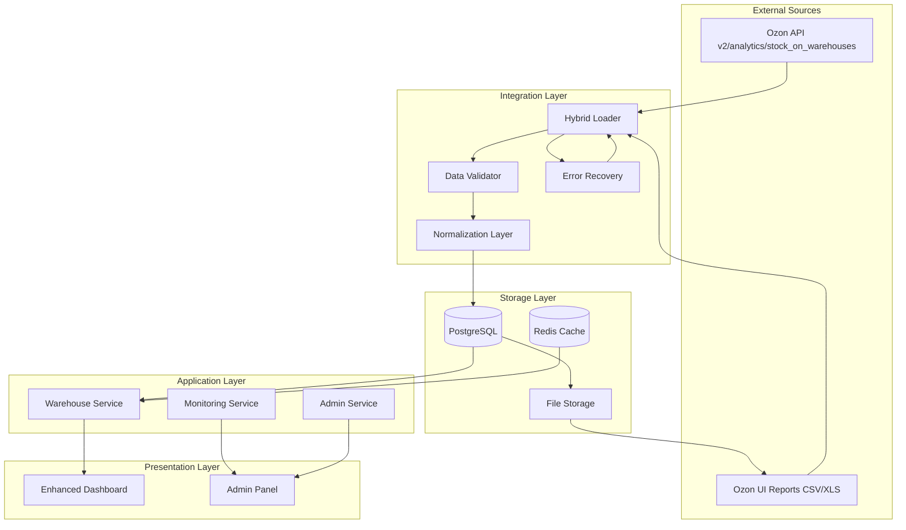
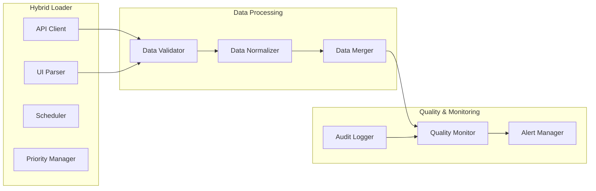

# Design Document - Warehouse Multi-Source Integration

## Overview

Warehouse Multi-Source Integration System - это модернизированная система управления данными складов, которая объединяет данные из Ozon API и UI-отчетов через гибридную архитектуру с валидацией качества, автоматическим восстановлением после ошибок и enterprise-уровнем надежности.

## Architecture

### High-Level Architecture



### Component Architecture



## Data Models

### Enhanced Database Schema

#### Расширение таблицы `inventory`

```sql
-- Добавляем поля для multi-source integration
ALTER TABLE inventory ADD COLUMN IF NOT EXISTS data_source VARCHAR(20) DEFAULT 'unknown'
    CHECK (data_source IN ('api', 'ui_report', 'mixed', 'manual', 'unknown'));
ALTER TABLE inventory ADD COLUMN IF NOT EXISTS data_quality_score INTEGER DEFAULT 0
    CHECK (data_quality_score >= 0 AND data_quality_score <= 100);
ALTER TABLE inventory ADD COLUMN IF NOT EXISTS last_api_sync TIMESTAMP WITH TIME ZONE;
ALTER TABLE inventory ADD COLUMN IF NOT EXISTS last_ui_sync TIMESTAMP WITH TIME ZONE;
ALTER TABLE inventory ADD COLUMN IF NOT EXISTS source_priority INTEGER DEFAULT 1;
ALTER TABLE inventory ADD COLUMN IF NOT EXISTS validation_status VARCHAR(20) DEFAULT 'pending'
    CHECK (validation_status IN ('pending', 'validated', 'conflict', 'error'));
ALTER TABLE inventory ADD COLUMN IF NOT EXISTS normalized_warehouse_name VARCHAR(255);
ALTER TABLE inventory ADD COLUMN IF NOT EXISTS original_warehouse_name VARCHAR(255);

-- Индексы для производительности
CREATE INDEX IF NOT EXISTS idx_inventory_data_source ON inventory(data_source);
CREATE INDEX IF NOT EXISTS idx_inventory_quality_score ON inventory(data_quality_score);
CREATE INDEX IF NOT EXISTS idx_inventory_validation_status ON inventory(validation_status);
CREATE INDEX IF NOT EXISTS idx_inventory_normalized_warehouse ON inventory(normalized_warehouse_name);
```

#### Новая таблица `inventory_audit`

```sql
CREATE TABLE IF NOT EXISTS inventory_audit (
    id SERIAL PRIMARY KEY,
    inventory_id INTEGER REFERENCES inventory(id),
    product_id INTEGER NOT NULL,
    warehouse_name VARCHAR(255) NOT NULL,

    -- Snapshot данных до изменения
    old_available INTEGER,
    old_reserved INTEGER,
    old_data_source VARCHAR(20),
    old_quality_score INTEGER,

    -- Snapshot данных после изменения
    new_available INTEGER,
    new_reserved INTEGER,
    new_data_source VARCHAR(20),
    new_quality_score INTEGER,

    -- Метаданные изменения
    change_type VARCHAR(50) NOT NULL, -- 'insert', 'update', 'delete', 'merge'
    change_source VARCHAR(50) NOT NULL, -- 'api_sync', 'ui_import', 'manual_edit', 'system_merge'
    initiated_by VARCHAR(100), -- user_id или 'system'
    change_reason TEXT,

    -- Временные метки
    changed_at TIMESTAMP WITH TIME ZONE DEFAULT CURRENT_TIMESTAMP,

    -- Дополнительные метаданные
    api_request_id VARCHAR(100), -- для трассировки API запросов
    ui_file_name VARCHAR(255), -- для трассировки UI файлов
    batch_id UUID, -- для группировки массовых операций

    CONSTRAINT audit_valid_change_type CHECK (
        change_type IN ('insert', 'update', 'delete', 'merge', 'rollback')
    ),
    CONSTRAINT audit_valid_source CHECK (
        change_source IN ('api_sync', 'ui_import', 'manual_edit', 'system_merge', 'error_recovery')
    )
);

-- Индексы для audit trail
CREATE INDEX idx_audit_inventory_id ON inventory_audit(inventory_id);
CREATE INDEX idx_audit_product_warehouse ON inventory_audit(product_id, warehouse_name);
CREATE INDEX idx_audit_changed_at ON inventory_audit(changed_at);
CREATE INDEX idx_audit_change_source ON inventory_audit(change_source);
CREATE INDEX idx_audit_batch_id ON inventory_audit(batch_id);
```

#### Новая таблица `data_quality_log`

```sql
CREATE TABLE IF NOT EXISTS data_quality_log (
    id SERIAL PRIMARY KEY,

    -- Идентификация проверки
    validation_batch_id UUID NOT NULL,
    warehouse_name VARCHAR(255),
    product_id INTEGER,

    -- Результаты валидации
    api_value INTEGER,
    ui_value INTEGER,
    discrepancy_percent DECIMAL(5,2),
    discrepancy_absolute INTEGER,

    -- Статус и действия
    validation_status VARCHAR(50) NOT NULL,
    resolution_action VARCHAR(100),
    quality_score INTEGER CHECK (quality_score >= 0 AND quality_score <= 100),

    -- Метаданные
    validated_at TIMESTAMP WITH TIME ZONE DEFAULT CURRENT_TIMESTAMP,
    validator_version VARCHAR(20),
    notes TEXT,

    CONSTRAINT quality_valid_status CHECK (
        validation_status IN ('passed', 'warning', 'failed', 'manual_review', 'resolved')
    )
);

-- Индексы для quality monitoring
CREATE INDEX idx_quality_batch_id ON data_quality_log(validation_batch_id);
CREATE INDEX idx_quality_warehouse ON data_quality_log(warehouse_name);
CREATE INDEX idx_quality_status ON data_quality_log(validation_status);
CREATE INDEX idx_quality_validated_at ON data_quality_log(validated_at);
```

#### Новая таблица `warehouse_normalization`

```sql
CREATE TABLE IF NOT EXISTS warehouse_normalization (
    id SERIAL PRIMARY KEY,

    -- Нормализация названий складов
    original_name VARCHAR(255) NOT NULL,
    normalized_name VARCHAR(255) NOT NULL,
    source_type VARCHAR(20) NOT NULL, -- 'api', 'ui_report'

    -- Метаданные
    confidence_score DECIMAL(3,2) DEFAULT 1.0, -- 0.0 - 1.0
    created_at TIMESTAMP WITH TIME ZONE DEFAULT CURRENT_TIMESTAMP,
    updated_at TIMESTAMP WITH TIME ZONE DEFAULT CURRENT_TIMESTAMP,
    created_by VARCHAR(100) DEFAULT 'system',

    -- Дополнительная информация
    cluster_name VARCHAR(100),
    warehouse_code VARCHAR(50),
    is_active BOOLEAN DEFAULT true,

    UNIQUE(original_name, source_type),
    CONSTRAINT norm_valid_source CHECK (source_type IN ('api', 'ui_report', 'manual'))
);

-- Индексы для нормализации
CREATE INDEX idx_norm_original_name ON warehouse_normalization(original_name);
CREATE INDEX idx_norm_normalized_name ON warehouse_normalization(normalized_name);
CREATE INDEX idx_norm_source_type ON warehouse_normalization(source_type);
```

#### Новая таблица `sync_status`

```sql
CREATE TABLE IF NOT EXISTS sync_status (
    id SERIAL PRIMARY KEY,

    -- Идентификация синхронизации
    sync_type VARCHAR(50) NOT NULL, -- 'api_full', 'api_incremental', 'ui_import'
    source_name VARCHAR(100) NOT NULL, -- 'ozon_api', 'ui_stock_report', 'ui_sales_report'

    -- Статус выполнения
    status VARCHAR(50) NOT NULL DEFAULT 'pending',
    started_at TIMESTAMP WITH TIME ZONE DEFAULT CURRENT_TIMESTAMP,
    completed_at TIMESTAMP WITH TIME ZONE,

    -- Результаты
    records_processed INTEGER DEFAULT 0,
    records_inserted INTEGER DEFAULT 0,
    records_updated INTEGER DEFAULT 0,
    records_failed INTEGER DEFAULT 0,

    -- Ошибки и retry
    error_message TEXT,
    retry_count INTEGER DEFAULT 0,
    max_retries INTEGER DEFAULT 3,
    next_retry_at TIMESTAMP WITH TIME ZONE,

    -- Метаданные
    batch_id UUID,
    file_path VARCHAR(500), -- для UI imports
    api_endpoint VARCHAR(200), -- для API calls

    CONSTRAINT sync_valid_status CHECK (
        status IN ('pending', 'running', 'completed', 'failed', 'retrying', 'cancelled')
    ),
    CONSTRAINT sync_valid_type CHECK (
        sync_type IN ('api_full', 'api_incremental', 'ui_import', 'manual_sync')
    )
);

-- Индексы для sync monitoring
CREATE INDEX idx_sync_status ON sync_status(status);
CREATE INDEX idx_sync_type ON sync_status(sync_type);
CREATE INDEX idx_sync_started_at ON sync_status(started_at);
CREATE INDEX idx_sync_batch_id ON sync_status(batch_id);
```

### TypeScript Types

```typescript
// Enhanced warehouse types
export interface WarehouseItemEnhanced extends WarehouseItem {
    // Source metadata
    data_source: "api" | "ui_report" | "mixed" | "manual";
    data_quality_score: number; // 0-100
    last_api_sync: string | null;
    last_ui_sync: string | null;
    validation_status: "pending" | "validated" | "conflict" | "error";

    // Normalization
    normalized_warehouse_name: string;
    original_warehouse_name: string;

    // Quality indicators
    freshness_minutes: number;
    discrepancy_percent?: number;
    source_priority: number;
}

// Data quality metrics
export interface DataQualityMetrics {
    overall_score: number;
    api_coverage_percent: number;
    ui_coverage_percent: number;
    validation_pass_rate: number;
    average_freshness_minutes: number;
    discrepancy_rate: number;
    last_validation: string;
}

// Sync status
export interface SyncStatus {
    id: number;
    sync_type: "api_full" | "api_incremental" | "ui_import";
    source_name: string;
    status: "pending" | "running" | "completed" | "failed" | "retrying";
    started_at: string;
    completed_at?: string;
    records_processed: number;
    records_inserted: number;
    records_updated: number;
    records_failed: number;
    error_message?: string;
    retry_count: number;
    progress_percent?: number;
}

// Enhanced dashboard data
export interface EnhancedDashboardData extends WarehouseDashboardData {
    data_quality: DataQualityMetrics;
    sync_status: SyncStatus[];
    source_distribution: {
        api_only: number;
        ui_only: number;
        mixed: number;
        conflicts: number;
    };
    freshness_distribution: {
        fresh: number; // < 1 hour
        acceptable: number; // 1-6 hours
        stale: number; // > 6 hours
    };
}

// Admin interfaces
export interface SourcePriorityConfig {
    api_priority: number;
    ui_priority: number;
    fallback_enabled: boolean;
    max_discrepancy_percent: number;
    auto_resolution_enabled: boolean;
}

export interface ValidationRule {
    id: string;
    name: string;
    description: string;
    enabled: boolean;
    threshold_percent: number;
    action: "warn" | "block" | "auto_fix";
}
```

## Components and Interfaces

### Backend Services

#### HybridLoader Service

Основной сервис для управления загрузкой из разных источников.

```php
class HybridLoader {
    private ApiClient $apiClient;
    private UiParser $uiParser;
    private DataValidator $validator;
    private ErrorRecovery $errorRecovery;
    private AuditLogger $auditLogger;

    public function syncWarehouseData(array $options = []): SyncResult {
        $batchId = $this->generateBatchId();
        $this->auditLogger->startBatch($batchId, 'hybrid_sync');

        try {
            // 1. Попытка загрузки через API
            $apiResult = $this->loadFromApi($batchId);

            // 2. Загрузка UI-отчетов как дополнение/fallback
            $uiResult = $this->loadFromUi($batchId);

            // 3. Валидация и объединение данных
            $mergedResult = $this->validator->validateAndMerge($apiResult, $uiResult);

            // 4. Сохранение результатов
            $this->saveResults($mergedResult, $batchId);

            return new SyncResult($batchId, 'success', $mergedResult);

        } catch (Exception $e) {
            $this->errorRecovery->handleSyncError($e, $batchId);
            throw $e;
        }
    }

    private function loadFromApi(string $batchId): ApiResult {
        $syncStatus = $this->createSyncStatus('api_full', 'ozon_api', $batchId);

        try {
            $response = $this->apiClient->getStockOnWarehouses();
            $this->updateSyncStatus($syncStatus->id, 'completed', $response->getMetrics());
            return $response;

        } catch (ApiException $e) {
            $this->updateSyncStatus($syncStatus->id, 'failed', null, $e->getMessage());

            if ($this->errorRecovery->shouldRetry($e)) {
                return $this->errorRecovery->retryApiCall($this->apiClient, $syncStatus);
            }

            throw $e;
        }
    }

    private function loadFromUi(string $batchId): UiResult {
        $files = $this->uiParser->findNewReports();
        $results = [];

        foreach ($files as $file) {
            $syncStatus = $this->createSyncStatus('ui_import', basename($file), $batchId);

            try {
                $result = $this->uiParser->parseReport($file);
                $this->updateSyncStatus($syncStatus->id, 'completed', $result->getMetrics());
                $results[] = $result;

                // Архивируем обработанный файл
                $this->archiveProcessedFile($file);

            } catch (ParseException $e) {
                $this->updateSyncStatus($syncStatus->id, 'failed', null, $e->getMessage());
                $this->errorRecovery->handleParseError($e, $file, $syncStatus);
            }
        }

        return new UiResult($results);
    }
}
```

#### DataValidator Service

Сервис для валидации и сравнения данных из разных источников.

```php
class DataValidator {
    private NormalizationLayer $normalizer;
    private QualityCalculator $qualityCalculator;
    private ConflictResolver $conflictResolver;

    public function validateAndMerge(ApiResult $apiResult, UiResult $uiResult): MergedResult {
        $validationBatchId = Uuid::uuid4()->toString();

        // 1. Нормализация данных
        $normalizedApi = $this->normalizer->normalizeApiData($apiResult);
        $normalizedUi = $this->normalizer->normalizeUiData($uiResult);

        // 2. Сравнение данных
        $comparisons = $this->compareDataSources($normalizedApi, $normalizedUi, $validationBatchId);

        // 3. Разрешение конфликтов
        $resolvedData = $this->conflictResolver->resolveConflicts($comparisons);

        // 4. Расчет качества данных
        $qualityScores = $this->qualityCalculator->calculateQualityScores($resolvedData);

        return new MergedResult($resolvedData, $qualityScores, $validationBatchId);
    }

    private function compareDataSources(array $apiData, array $uiData, string $batchId): array {
        $comparisons = [];

        foreach ($apiData as $warehouse => $apiItems) {
            $uiItems = $uiData[$warehouse] ?? [];

            foreach ($apiItems as $sku => $apiItem) {
                $uiItem = $uiItems[$sku] ?? null;

                $comparison = $this->compareItems($apiItem, $uiItem, $warehouse, $sku);
                $this->logQualityCheck($comparison, $batchId);

                $comparisons[] = $comparison;
            }
        }

        return $comparisons;
    }

    private function compareItems(?array $apiItem, ?array $uiItem, string $warehouse, string $sku): array {
        if (!$apiItem && !$uiItem) {
            return ['status' => 'no_data', 'warehouse' => $warehouse, 'sku' => $sku];
        }

        if (!$apiItem) {
            return [
                'status' => 'ui_only',
                'warehouse' => $warehouse,
                'sku' => $sku,
                'data' => $uiItem,
                'quality_score' => 80
            ];
        }

        if (!$uiItem) {
            return [
                'status' => 'api_only',
                'warehouse' => $warehouse,
                'sku' => $sku,
                'data' => $apiItem,
                'quality_score' => 100
            ];
        }

        // Сравниваем значения
        $apiAvailable = $apiItem['available'] ?? 0;
        $uiAvailable = $uiItem['available'] ?? 0;

        $discrepancy = $this->calculateDiscrepancy($apiAvailable, $uiAvailable);

        if ($discrepancy <= 5) {
            return [
                'status' => 'validated',
                'warehouse' => $warehouse,
                'sku' => $sku,
                'data' => $apiItem, // Приоритет API
                'quality_score' => 100,
                'discrepancy_percent' => $discrepancy
            ];
        } elseif ($discrepancy <= 15) {
            return [
                'status' => 'warning',
                'warehouse' => $warehouse,
                'sku' => $sku,
                'data' => $apiItem, // Приоритет API
                'quality_score' => 85,
                'discrepancy_percent' => $discrepancy,
                'ui_data' => $uiItem
            ];
        } else {
            return [
                'status' => 'conflict',
                'warehouse' => $warehouse,
                'sku' => $sku,
                'api_data' => $apiItem,
                'ui_data' => $uiItem,
                'quality_score' => 60,
                'discrepancy_percent' => $discrepancy
            ];
        }
    }
}
```

#### ErrorRecovery Service

Сервис для автоматического восстановления после ошибок.

```php
class ErrorRecovery {
    private const MAX_RETRIES = 3;
    private const RETRY_DELAYS = [1, 2, 4, 8, 16]; // seconds

    private CircuitBreaker $circuitBreaker;
    private NotificationService $notificationService;

    public function handleSyncError(Exception $e, string $batchId): void {
        $this->logError($e, $batchId);

        if ($e instanceof ApiRateLimitException) {
            $this->handleRateLimit($e, $batchId);
        } elseif ($e instanceof ApiTimeoutException) {
            $this->handleTimeout($e, $batchId);
        } elseif ($e instanceof ParseException) {
            $this->handleParseError($e, null, null);
        } else {
            $this->handleGenericError($e, $batchId);
        }
    }

    public function retryApiCall(ApiClient $apiClient, SyncStatus $syncStatus): ApiResult {
        $retryCount = $syncStatus->retry_count;

        if ($retryCount >= self::MAX_RETRIES) {
            $this->notificationService->sendAlert(
                'API retry limit exceeded',
                "Failed to sync after {$retryCount} attempts"
            );
            throw new MaxRetriesExceededException();
        }

        // Exponential backoff
        $delay = self::RETRY_DELAYS[$retryCount] ?? 16;
        sleep($delay);

        // Circuit breaker check
        if ($this->circuitBreaker->isOpen()) {
            throw new CircuitBreakerOpenException();
        }

        try {
            $this->updateSyncStatus($syncStatus->id, 'retrying', null, null, $retryCount + 1);

            $result = $apiClient->getStockOnWarehouses();

            $this->circuitBreaker->recordSuccess();
            $this->updateSyncStatus($syncStatus->id, 'completed', $result->getMetrics());

            return $result;

        } catch (Exception $e) {
            $this->circuitBreaker->recordFailure();

            if ($retryCount + 1 < self::MAX_RETRIES) {
                $nextRetry = new DateTime('+' . self::RETRY_DELAYS[$retryCount + 1] . ' seconds');
                $this->updateSyncStatus(
                    $syncStatus->id,
                    'failed',
                    null,
                    $e->getMessage(),
                    $retryCount + 1,
                    $nextRetry
                );
            }

            throw $e;
        }
    }

    public function handleParseError(ParseException $e, ?string $filePath, ?SyncStatus $syncStatus): void {
        if ($filePath) {
            // Перемещаем проблемный файл в карантин
            $quarantinePath = $this->moveToQuarantine($filePath);

            $this->logError($e, null, [
                'file_path' => $filePath,
                'quarantine_path' => $quarantinePath,
                'error_type' => 'parse_error'
            ]);
        }

        if ($syncStatus && $syncStatus->retry_count < self::MAX_RETRIES) {
            // Планируем повторную попытку через 10 минут
            $nextRetry = new DateTime('+10 minutes');
            $this->updateSyncStatus(
                $syncStatus->id,
                'failed',
                null,
                $e->getMessage(),
                $syncStatus->retry_count + 1,
                $nextRetry
            );
        }
    }
}
```

#### NormalizationLayer Service

Сервис для приведения данных к единому формату.

```php
class NormalizationLayer {
    private WarehouseNormalizer $warehouseNormalizer;
    private SkuNormalizer $skuNormalizer;

    public function normalizeApiData(ApiResult $apiResult): array {
        $normalized = [];

        foreach ($apiResult->getData() as $item) {
            $normalizedWarehouse = $this->warehouseNormalizer->normalize(
                $item['warehouse_name'],
                'api'
            );

            $normalizedSku = $this->skuNormalizer->normalize($item['sku']);

            $normalized[$normalizedWarehouse][$normalizedSku] = [
                'sku' => $normalizedSku,
                'available' => (int)$item['available'],
                'reserved' => (int)$item['reserved'],
                'preparing_for_sale' => (int)($item['preparing_for_sale'] ?? 0),
                'in_transit' => (int)($item['in_transit'] ?? 0),
                'source' => 'api',
                'original_warehouse_name' => $item['warehouse_name'],
                'normalized_warehouse_name' => $normalizedWarehouse,
                'sync_timestamp' => new DateTime()
            ];
        }

        return $normalized;
    }

    public function normalizeUiData(UiResult $uiResult): array {
        $normalized = [];

        foreach ($uiResult->getData() as $report) {
            foreach ($report->getItems() as $item) {
                $normalizedWarehouse = $this->warehouseNormalizer->normalize(
                    $item['warehouse_name'],
                    'ui_report'
                );

                $normalizedSku = $this->skuNormalizer->normalize($item['sku']);

                $normalized[$normalizedWarehouse][$normalizedSku] = [
                    'sku' => $normalizedSku,
                    'available' => (int)$item['available'],
                    'reserved' => (int)($item['reserved'] ?? 0),
                    'preparing_for_sale' => (int)($item['preparing_for_sale'] ?? 0),
                    'in_transit' => (int)($item['in_transit'] ?? 0),
                    'source' => 'ui_report',
                    'original_warehouse_name' => $item['warehouse_name'],
                    'normalized_warehouse_name' => $normalizedWarehouse,
                    'sync_timestamp' => new DateTime(),
                    'file_name' => $report->getFileName()
                ];
            }
        }

        return $normalized;
    }
}

class WarehouseNormalizer {
    private array $normalizationRules;

    public function __construct() {
        $this->loadNormalizationRules();
    }

    public function normalize(string $warehouseName, string $sourceType): string {
        // Удаляем лишние пробелы и приводим к единому регистру
        $cleaned = trim(mb_strtoupper($warehouseName));

        // Проверяем существующие правила нормализации
        $existing = $this->findExistingRule($cleaned, $sourceType);
        if ($existing) {
            return $existing['normalized_name'];
        }

        // Применяем автоматические правила
        $normalized = $this->applyAutoRules($cleaned);

        // Сохраняем новое правило для будущего использования
        $this->saveNormalizationRule($cleaned, $normalized, $sourceType);

        return $normalized;
    }

    private function applyAutoRules(string $name): string {
        // Стандартизация сокращений
        $rules = [
            '/РФЦ$/' => '_РФЦ',
            '/\s+/' => '_',
            '/[^\w\-_]/' => '',
            '/_+/' => '_'
        ];

        foreach ($rules as $pattern => $replacement) {
            $name = preg_replace($pattern, $replacement, $name);
        }

        return trim($name, '_');
    }
}
```

### Frontend Components

#### Enhanced Dashboard Components

```typescript
// Enhanced warehouse table with source indicators
export const EnhancedWarehouseTable: React.FC<EnhancedWarehouseTableProps> = ({
    data,
    sortConfig,
    onSort,
    qualityMetrics,
}) => {
    return (
        <div className="enhanced-warehouse-table">
            <DataQualityHeader metrics={qualityMetrics} />

            <table className="warehouse-table">
                <thead>
                    <tr>
                        <th
                            onClick={() =>
                                onSort({ field: "name", order: "asc" })
                            }
                        >
                            Товар
                        </th>
                        <th
                            onClick={() =>
                                onSort({
                                    field: "warehouse_name",
                                    order: "asc",
                                })
                            }
                        >
                            Склад
                            <SourceLegend />
                        </th>
                        <th
                            onClick={() =>
                                onSort({ field: "available", order: "desc" })
                            }
                        >
                            Доступно
                        </th>
                        <th
                            onClick={() =>
                                onSort({
                                    field: "data_quality_score",
                                    order: "desc",
                                })
                            }
                        >
                            Качество
                        </th>
                        <th
                            onClick={() =>
                                onSort({
                                    field: "freshness_minutes",
                                    order: "asc",
                                })
                            }
                        >
                            Свежесть
                        </th>
                        {/* ... остальные колонки */}
                    </tr>
                </thead>
                <tbody>
                    {data.map((warehouse) => (
                        <EnhancedWarehouseGroupRow
                            key={warehouse.warehouse_name}
                            group={warehouse}
                        />
                    ))}
                </tbody>
            </table>
        </div>
    );
};

// Source indicator component
export const SourceIndicator: React.FC<SourceIndicatorProps> = ({
    dataSource,
    qualityScore,
    freshnessMinutes,
    discrepancyPercent,
}) => {
    const getSourceColor = (source: string, quality: number) => {
        if (quality >= 95) return "text-green-600";
        if (quality >= 80) return "text-yellow-600";
        return "text-red-600";
    };

    const getSourceIcon = (source: string) => {
        switch (source) {
            case "api":
                return "🔗";
            case "ui_report":
                return "📊";
            case "mixed":
                return "🔄";
            case "manual":
                return "✏️";
            default:
                return "❓";
        }
    };

    return (
        <Tooltip
            content={
                <SourceTooltip
                    dataSource={dataSource}
                    qualityScore={qualityScore}
                    freshnessMinutes={freshnessMinutes}
                    discrepancyPercent={discrepancyPercent}
                />
            }
        >
            <span
                className={`source-indicator ${getSourceColor(
                    dataSource,
                    qualityScore
                )}`}
            >
                {getSourceIcon(dataSource)}
            </span>
        </Tooltip>
    );
};

// Data quality header
export const DataQualityHeader: React.FC<DataQualityHeaderProps> = ({
    metrics,
}) => {
    return (
        <div className="data-quality-header">
            <div className="quality-metrics">
                <QualityMetric
                    label="Общее качество"
                    value={metrics.overall_score}
                    format="percentage"
                    threshold={90}
                />
                <QualityMetric
                    label="API покрытие"
                    value={metrics.api_coverage_percent}
                    format="percentage"
                    threshold={80}
                />
                <QualityMetric
                    label="Валидация"
                    value={metrics.validation_pass_rate}
                    format="percentage"
                    threshold={95}
                />
                <QualityMetric
                    label="Свежесть"
                    value={metrics.average_freshness_minutes}
                    format="minutes"
                    threshold={60}
                />
            </div>

            <div className="quality-actions">
                <RefreshButton onRefresh={() => window.location.reload()} />
                <SyncStatusIndicator />
            </div>
        </div>
    );
};

// Enhanced filters with source filtering
export const EnhancedWarehouseFilters: React.FC<EnhancedFiltersProps> = ({
    filters,
    onChange,
    qualityMetrics,
}) => {
    return (
        <div className="enhanced-filters">
            {/* Existing filters */}
            <Select
                label="Склад"
                options={warehouses}
                value={filters.warehouse}
                onChange={(value) => onChange({ ...filters, warehouse: value })}
            />

            {/* New source-related filters */}
            <Select
                label="Источник данных"
                options={[
                    { value: "api", label: "🔗 API" },
                    { value: "ui_report", label: "📊 UI отчеты" },
                    { value: "mixed", label: "🔄 Смешанные" },
                    { value: "manual", label: "✏️ Ручные" },
                ]}
                value={filters.data_source}
                onChange={(value) =>
                    onChange({ ...filters, data_source: value })
                }
            />

            <Select
                label="Качество данных"
                options={[
                    { value: "high", label: "≥95% Высокое" },
                    { value: "medium", label: "80-94% Среднее" },
                    { value: "low", label: "<80% Низкое" },
                ]}
                value={filters.quality_level}
                onChange={(value) =>
                    onChange({ ...filters, quality_level: value })
                }
            />

            <Checkbox
                label="Только API данные"
                checked={filters.api_only}
                onChange={(checked) =>
                    onChange({ ...filters, api_only: checked })
                }
            />

            <Checkbox
                label="Показать конфликты"
                checked={filters.show_conflicts}
                onChange={(checked) =>
                    onChange({ ...filters, show_conflicts: checked })
                }
            />
        </div>
    );
};
```

#### Admin Panel Components

```typescript
// Admin dashboard for managing data sources
export const AdminDashboard: React.FC = () => {
    const [syncStatuses, setSyncStatuses] = useState<SyncStatus[]>([]);
    const [qualityMetrics, setQualityMetrics] =
        useState<DataQualityMetrics | null>(null);
    const [sourcePriority, setSourcePriority] =
        useState<SourcePriorityConfig | null>(null);

    return (
        <div className="admin-dashboard">
            <h1>Управление источниками данных</h1>

            <div className="admin-sections">
                <SyncStatusPanel
                    statuses={syncStatuses}
                    onManualSync={handleManualSync}
                />

                <QualityMetricsPanel
                    metrics={qualityMetrics}
                    onRefresh={refreshMetrics}
                />

                <SourcePriorityPanel
                    config={sourcePriority}
                    onChange={updateSourcePriority}
                />

                <ValidationRulesPanel />

                <AuditTrailPanel />
            </div>
        </div>
    );
};

// Sync status monitoring
export const SyncStatusPanel: React.FC<SyncStatusPanelProps> = ({
    statuses,
    onManualSync,
}) => {
    return (
        <div className="sync-status-panel">
            <div className="panel-header">
                <h2>Статус синхронизации</h2>
                <button onClick={onManualSync} className="btn-primary">
                    Запустить синхронизацию
                </button>
            </div>

            <div className="sync-statuses">
                {statuses.map((status) => (
                    <SyncStatusCard key={status.id} status={status} />
                ))}
            </div>
        </div>
    );
};

// Quality metrics monitoring
export const QualityMetricsPanel: React.FC<QualityMetricsPanelProps> = ({
    metrics,
    onRefresh,
}) => {
    if (!metrics) return <LoadingSpinner />;

    return (
        <div className="quality-metrics-panel">
            <div className="panel-header">
                <h2>Метрики качества данных</h2>
                <button onClick={onRefresh} className="btn-secondary">
                    Обновить
                </button>
            </div>

            <div className="metrics-grid">
                <MetricCard
                    title="Общее качество"
                    value={metrics.overall_score}
                    format="percentage"
                    trend={calculateTrend(metrics.overall_score)}
                />

                <MetricCard
                    title="Покрытие API"
                    value={metrics.api_coverage_percent}
                    format="percentage"
                    trend={calculateTrend(metrics.api_coverage_percent)}
                />

                <MetricCard
                    title="Успешная валидация"
                    value={metrics.validation_pass_rate}
                    format="percentage"
                    trend={calculateTrend(metrics.validation_pass_rate)}
                />

                <MetricCard
                    title="Средняя свежесть"
                    value={metrics.average_freshness_minutes}
                    format="minutes"
                    trend={calculateTrend(
                        metrics.average_freshness_minutes,
                        true
                    )}
                />
            </div>

            <QualityChart metrics={metrics} />
        </div>
    );
};
```

## Error Handling

### Comprehensive Error Recovery

```php
class ComprehensiveErrorHandler {
    private ErrorRecovery $errorRecovery;
    private NotificationService $notifications;
    private AuditLogger $auditLogger;

    public function handleError(Exception $e, array $context = []): void {
        $errorId = $this->generateErrorId();

        // Логируем ошибку с полным контекстом
        $this->auditLogger->logError($errorId, $e, $context);

        // Определяем тип ошибки и стратегию восстановления
        $strategy = $this->determineRecoveryStrategy($e);

        switch ($strategy) {
            case 'retry':
                $this->errorRecovery->scheduleRetry($e, $context);
                break;

            case 'fallback':
                $this->errorRecovery->activateFallback($context);
                break;

            case 'alert':
                $this->notifications->sendCriticalAlert($e, $context);
                break;

            case 'ignore':
                // Логируем, но не предпринимаем действий
                break;
        }
    }

    private function determineRecoveryStrategy(Exception $e): string {
        if ($e instanceof ApiRateLimitException) {
            return 'retry'; // Повторить с задержкой
        }

        if ($e instanceof ApiTimeoutException) {
            return 'fallback'; // Переключиться на UI-отчеты
        }

        if ($e instanceof ParseException) {
            return 'alert'; // Уведомить администратора
        }

        if ($e instanceof ValidationException) {
            return 'ignore'; // Логировать для анализа
        }

        return 'alert'; // По умолчанию уведомляем
    }
}
```

## Testing Strategy

### Comprehensive Testing Approach

```php
// Unit tests for core services
class HybridLoaderTest extends TestCase {
    public function testApiPriorityOverUi(): void {
        $apiResult = $this->createMockApiResult();
        $uiResult = $this->createMockUiResult();

        $loader = new HybridLoader($this->mockApiClient, $this->mockUiParser);
        $result = $loader->syncWarehouseData();

        $this->assertEquals('api', $result->getPrimarySource());
        $this->assertGreaterThan(90, $result->getQualityScore());
    }

    public function testFallbackToUiWhenApiUnavailable(): void {
        $this->mockApiClient->method('getStockOnWarehouses')
            ->willThrowException(new ApiException('Service unavailable'));

        $loader = new HybridLoader($this->mockApiClient, $this->mockUiParser);
        $result = $loader->syncWarehouseData();

        $this->assertEquals('ui_report', $result->getPrimarySource());
        $this->assertLessThan(90, $result->getQualityScore());
    }
}

class DataValidatorTest extends TestCase {
    public function testDiscrepancyDetection(): void {
        $apiData = ['available' => 100];
        $uiData = ['available' => 120];

        $validator = new DataValidator();
        $result = $validator->compareItems($apiData, $uiData, 'TEST_WAREHOUSE', 'TEST_SKU');

        $this->assertEquals('warning', $result['status']);
        $this->assertEquals(20, $result['discrepancy_percent']);
    }

    public function testConflictResolution(): void {
        $apiData = ['available' => 100];
        $uiData = ['available' => 200]; // 100% discrepancy

        $validator = new DataValidator();
        $result = $validator->compareItems($apiData, $uiData, 'TEST_WAREHOUSE', 'TEST_SKU');

        $this->assertEquals('conflict', $result['status']);
        $this->assertArrayHasKey('api_data', $result);
        $this->assertArrayHasKey('ui_data', $result);
    }
}
```

```typescript
// Frontend integration tests
describe("Enhanced Warehouse Dashboard", () => {
    test("displays source indicators correctly", async () => {
        const mockData = createMockWarehouseData();
        render(<EnhancedWarehouseTable data={mockData} />);

        expect(screen.getByText("🔗")).toBeInTheDocument(); // API source
        expect(screen.getByText("📊")).toBeInTheDocument(); // UI source
    });

    test("filters by data source", async () => {
        const mockData = createMockWarehouseData();
        render(<EnhancedWarehouseDashboard />);

        const sourceFilter = screen.getByLabelText("Источник данных");
        fireEvent.change(sourceFilter, { target: { value: "api" } });

        await waitFor(() => {
            expect(screen.queryByText("📊")).not.toBeInTheDocument();
            expect(screen.getByText("🔗")).toBeInTheDocument();
        });
    });

    test("shows quality metrics", async () => {
        render(<DataQualityHeader metrics={mockQualityMetrics} />);

        expect(screen.getByText("Общее качество")).toBeInTheDocument();
        expect(screen.getByText("95%")).toBeInTheDocument();
    });
});
```

## Performance Considerations

### Optimization Strategies

1. **Caching Strategy**:

    - Redis cache для API ответов (TTL: 2 часа)
    - Кэш нормализованных данных (TTL: 24 часа)
    - Кэш качественных метрик (TTL: 1 час)

2. **Database Optimization**:

    - Партиционирование audit таблиц по дате
    - Индексы на часто используемые поля
    - Архивирование старых данных

3. **API Optimization**:

    - Batch processing для массовых операций
    - Асинхронная обработка UI-отчетов
    - Connection pooling для БД

4. **Frontend Optimization**:
    - Виртуализация больших таблиц
    - Lazy loading компонентов
    - Debounced фильтры

## Security

### Enhanced Security Measures

1. **API Security**:

    - Encrypted storage для API ключей
    - JWT токены для админ операций
    - Rate limiting (100 req/min per user)

2. **Data Security**:

    - Audit trail для всех изменений
    - Role-based access control
    - Data masking для sensitive информации

3. **File Security**:
    - Validation загружаемых файлов
    - Quarantine для подозрительных файлов
    - Virus scanning для UI-отчетов

## Deployment

### Deployment Strategy

1. **Database Migration**:

    ```sql
    -- Применение всех новых таблиц и полей
    \i migrations/001_add_multi_source_fields.sql
    \i migrations/002_create_audit_tables.sql
    \i migrations/003_create_quality_tables.sql
    ```

2. **Backend Deployment**:

    - Новые PHP сервисы
    - Обновленные API endpoints
    - Cron задачи для синхронизации

3. **Frontend Deployment**:

    - Обновленные React компоненты
    - Новые админ панели
    - Enhanced дашборд

4. **Configuration**:
    - Environment variables для API ключей
    - Redis configuration
    - Monitoring setup

---

## Summary

Дизайн предусматривает создание enterprise-уровня системы интеграции данных складов с гибридной архитектурой, comprehensive error handling, audit trail, data normalization, quality monitoring и полным тестовым покрытием. Система обеспечивает надежность, масштабируемость и соответствие лучшим практикам BI/ETL платформ.
