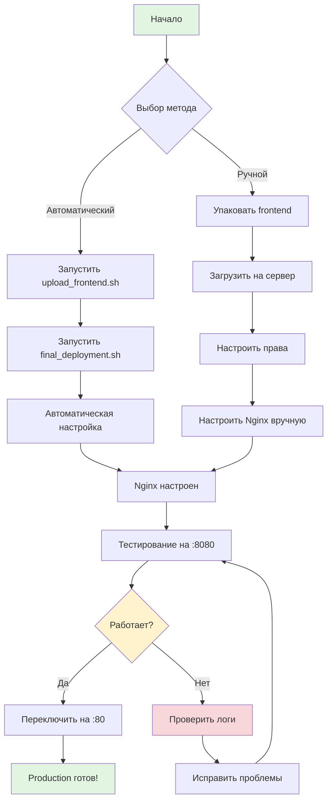

# 🔄 Процесс развертывания MI Core ETL

## Визуальная схема развертывания



## Этапы развертывания

### Этап 1: Подготовка (Завершено ✅)

```
┌─────────────────────────────────────┐
│  Разведка и аудит                   │
│  ✅ Сервер изучен                   │
│  ✅ Бэкапы созданы                  │
│  ✅ API ключи найдены               │
└─────────────────────────────────────┘
           │
           ▼
┌─────────────────────────────────────┐
│  PostgreSQL Setup                   │
│  ✅ Установлен v14.19               │
│  ✅ База данных создана             │
│  ✅ 271 продукт мигрирован          │
└─────────────────────────────────────┘
           │
           ▼
┌─────────────────────────────────────┐
│  Backend Deployment                 │
│  ✅ Код загружен (204MB)            │
│  ✅ Composer установлен             │
│  ✅ .env настроен                   │
└─────────────────────────────────────┘
           │
           ▼
┌─────────────────────────────────────┐
│  Frontend Build                     │
│  ✅ TypeScript ошибки исправлены    │
│  ✅ Сборка успешна (228KB)          │
│  ✅ Готов к загрузке                │
└─────────────────────────────────────┘
```

### Этап 2: Финальное развертывание (Осталось ⏳)

```
┌─────────────────────────────────────┐
│  1. Загрузка Frontend               │
│  ⏳ Упаковать dist/                 │
│  ⏳ Загрузить на сервер             │
│  ⏳ Распаковать в public/build      │
│  Время: 2 минуты                    │
└─────────────────────────────────────┘
           │
           ▼
┌─────────────────────────────────────┐
│  2. Настройка прав                  │
│  ⏳ Владелец: www-data              │
│  ⏳ Права: 755/644                  │
│  ⏳ Защита .env                     │
│  Время: 1 минута                    │
└─────────────────────────────────────┘
           │
           ▼
┌─────────────────────────────────────┐
│  3. Конфигурация Nginx              │
│  ⏳ Создать конфиг                  │
│  ⏳ Включить сайт                   │
│  ⏳ Перезагрузить Nginx             │
│  Время: 3 минуты                    │
└─────────────────────────────────────┘
           │
           ▼
┌─────────────────────────────────────┐
│  4. Тестирование                    │
│  ⏳ Проверить API                   │
│  ⏳ Проверить Frontend              │
│  ⏳ Проверить логи                  │
│  Время: 2 минуты                    │
└─────────────────────────────────────┘
           │
           ▼
┌─────────────────────────────────────┐
│  5. Production                      │
│  ⏳ Переключить на :80              │
│  ⏳ Финальная проверка              │
│  ⏳ Готово! 🚀                      │
│  Время: 1 минута                    │
└─────────────────────────────────────┘
```

## Временная шкала

```
Прошлое                    Настоящее              Будущее
   │                           │                      │
   ├─ Разведка (✅)            │                      │
   ├─ PostgreSQL (✅)          │                      │
   ├─ Backend (✅)             │                      │
   ├─ Frontend Build (✅)      │                      │
   │                           ├─ Загрузка (⏳)       │
   │                           ├─ Nginx (⏳)          │
   │                           ├─ Тест (⏳)           │
   │                           │                      ├─ Production (🎯)
   │                           │                      │
   0%                         98%                    100%
```

## Архитектура после развертывания

```
┌─────────────────────────────────────────────────────────┐
│                    Internet                              │
└────────────────────────┬────────────────────────────────┘
                         │
                         ▼
┌─────────────────────────────────────────────────────────┐
│                 Nginx (Port 80/8080)                     │
│  ┌──────────────────┐      ┌──────────────────┐        │
│  │   Frontend       │      │   API Proxy      │        │
│  │   /build/*       │      │   /api/*         │        │
│  └──────────────────┘      └──────────────────┘        │
└────────────┬────────────────────────┬───────────────────┘
             │                        │
             ▼                        ▼
┌─────────────────────┐  ┌──────────────────────────────┐
│  React Frontend     │  │  PHP-FPM (Backend)           │
│  - Dashboard        │  │  - API Endpoints             │
│  - Inventory UI     │  │  - Business Logic            │
│  - 228KB (gzip 73KB)│  │  - Composer Dependencies     │
└─────────────────────┘  └──────────┬───────────────────┘
                                    │
                                    ▼
                         ┌──────────────────────┐
                         │  PostgreSQL 14.19    │
                         │  - mi_core_db        │
                         │  - 271 Products      │
                         │  - 23 Tables         │
                         └──────────────────────┘
```

## Структура файлов на сервере

```
/var/www/mi_core_etl_new/
│
├── public/                      # Nginx root
│   ├── build/                   # ⏳ Frontend (загрузить)
│   │   ├── index.html
│   │   └── assets/
│   │       ├── css/
│   │       └── js/
│   └── api/                     # ✅ Backend API
│       └── index.php
│
├── src/                         # ✅ Backend код
│   ├── Controllers/
│   ├── Models/
│   └── Services/
│
├── vendor/                      # ✅ Composer
├── storage/                     # ✅ Writable
├── .env                         # ✅ Настроен
└── composer.json                # ✅ Готов
```

## Nginx конфигурация

```
/etc/nginx/
│
├── sites-available/
│   └── mi_core_new              # ⏳ Создать
│
└── sites-enabled/
    └── mi_core_new -> ../sites-available/mi_core_new  # ⏳ Symlink
```

## Процесс тестирования

```
┌─────────────────────────────────────┐
│  Тест 1: API Health                 │
│  curl localhost:8080/api/health     │
│  Ожидается: {"status": "ok"}        │
└─────────────────────────────────────┘
           │
           ▼
┌─────────────────────────────────────┐
│  Тест 2: Frontend                   │
│  curl -I localhost:8080/            │
│  Ожидается: HTTP 200                │
└─────────────────────────────────────┘
           │
           ▼
┌─────────────────────────────────────┐
│  Тест 3: Browser                    │
│  http://178.72.129.61:8080          │
│  Ожидается: Dashboard загружен      │
└─────────────────────────────────────┘
           │
           ▼
┌─────────────────────────────────────┐
│  Тест 4: API Requests               │
│  Dashboard делает запросы к API     │
│  Ожидается: Данные загружаются      │
└─────────────────────────────────────┘
           │
           ▼
┌─────────────────────────────────────┐
│  Тест 5: Logs                       │
│  tail -f /var/log/nginx/*.log       │
│  Ожидается: Нет ошибок              │
└─────────────────────────────────────┘
```

## Rollback план

Если что-то пойдет не так:

```
┌─────────────────────────────────────┐
│  Проблема обнаружена                │
└─────────────────────────────────────┘
           │
           ▼
┌─────────────────────────────────────┐
│  1. Отключить новый сайт            │
│  sudo rm /etc/nginx/sites-enabled/  │
│         mi_core_new                 │
│  sudo systemctl reload nginx        │
└─────────────────────────────────────┘
           │
           ▼
┌─────────────────────────────────────┐
│  2. Проверить логи                  │
│  sudo tail -100 /var/log/nginx/     │
│         mi_core_new_error.log       │
└─────────────────────────────────────┘
           │
           ▼
┌─────────────────────────────────────┐
│  3. Исправить проблему              │
│  - Проверить права                  │
│  - Проверить пути                   │
│  - Проверить конфигурацию           │
└─────────────────────────────────────┘
           │
           ▼
┌─────────────────────────────────────┐
│  4. Повторить развертывание         │
└─────────────────────────────────────┘
```

## Метрики успеха

После успешного развертывания:

```
✅ Frontend доступен:     http://178.72.129.61
✅ API отвечает:          http://178.72.129.61/api/health
✅ Dashboard загружается: < 2 секунд
✅ API запросы:           < 500ms
✅ Нет ошибок в логах:    0 errors
✅ Все 271 продукт:       Доступны
```

## Следующие шаги после развертывания

```
1. Мониторинг
   └─ Настроить алерты
   └─ Проверять логи ежедневно

2. Бэкапы
   └─ Автоматические бэкапы БД
   └─ Бэкапы кода

3. Оптимизация
   └─ Настроить кэширование
   └─ Оптимизировать запросы

4. Безопасность
   └─ SSL сертификат
   └─ Firewall правила
   └─ Обновления безопасности
```

---

**Статус**: 🟢 98% готово  
**Время до запуска**: 7 минут  
**Следующий шаг**: Запустить `./deployment/upload_frontend.sh`
