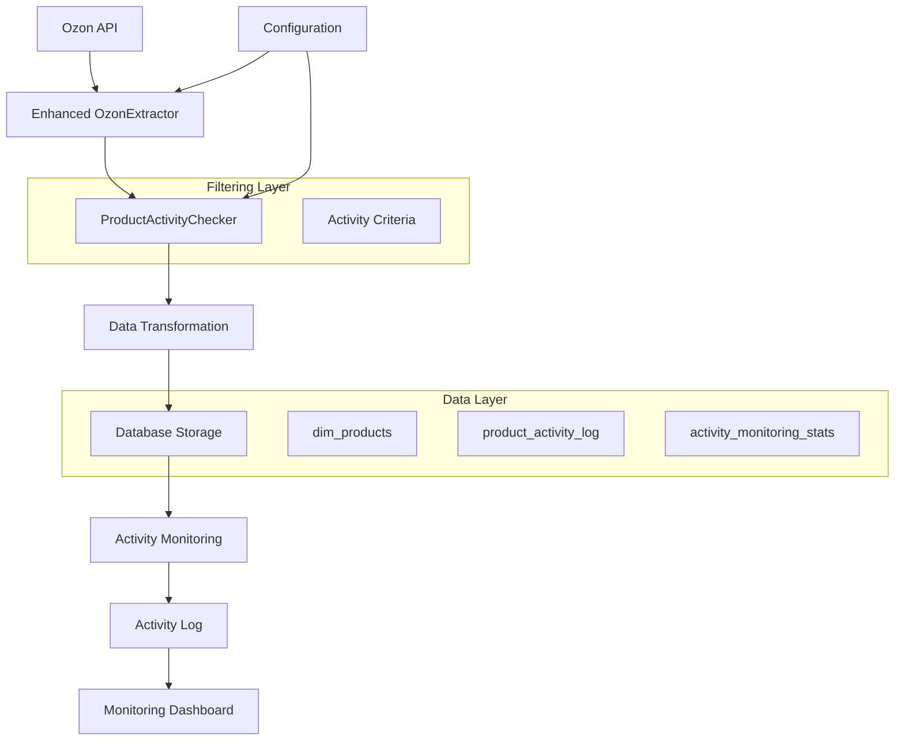

# ETL Process Documentation - Active Product Filtering

## Overview

This document describes the enhanced ETL (Extract, Transform, Load) process for Ozon data with active product filtering capabilities. The system now filters products based on activity criteria to process only relevant products (48 active vs 176 total).

## Architecture Overview



## ETL Components

### 1. Enhanced OzonExtractor

The `OzonExtractor` class has been enhanced to support active product filtering.

#### Key Features

- **API Filtering**: Uses `visibility: "VISIBLE"` filter in Ozon API calls
- **Activity Checking**: Integrates with `ProductActivityChecker` for real-time status
- **Batch Processing**: Efficiently processes products in configurable batches
- **Error Handling**: Robust error handling with retry mechanisms

#### Configuration

```php
// ETL Configuration for Active Filtering
$config = [
    'ozon' => [
        'filter_active_only' => true,
        'activity_check_interval' => 3600, // 1 hour
        'batch_size' => 100,
        'max_concurrent_requests' => 5,
        'activity_checker' => [
            'required_visibility' => 'VISIBLE',
            'required_state' => 'processed',
            'stock_threshold' => 0,
            'check_pricing' => true
        ]
    ]
];
```

#### Usage Example

```php
use MDM\ETL\Extractors\OzonExtractor;
use MDM\ETL\ActivityChecker\ProductActivityChecker;

// Initialize extractor with activity filtering
$extractor = new OzonExtractor($config['ozon']);
$activityChecker = new ProductActivityChecker($config['ozon']['activity_checker']);

// Set activity checker
$extractor->setActivityChecker($activityChecker);

// Extract only active products
$products = $extractor->extractActiveProducts();

echo "Extracted " . count($products) . " active products\n";
```

### 2. ProductActivityChecker

Determines product activity status based on multiple criteria.

#### Activity Criteria

1. **Visibility**: Product must be `VISIBLE` in Ozon
2. **State**: Product must be `processed`
3. **Stock**: Product must have `present > stock_threshold`
4. **Pricing**: Product must have valid pricing (optional)

#### Implementation

```php
class ProductActivityChecker
{
    private $config;

    public function __construct(array $config)
    {
        $this->config = $config;
    }

    public function isProductActive(array $productData, array $stockData = [], array $priceData = []): bool
    {
        // Check visibility
        if (($productData['visibility'] ?? '') !== $this->config['required_visibility']) {
            return false;
        }

        // Check state
        if (($productData['state'] ?? '') !== $this->config['required_state']) {
            return false;
        }

        // Check stock
        $present = $stockData['present'] ?? 0;
        if ($present <= $this->config['stock_threshold']) {
            return false;
        }

        // Check pricing (if enabled)
        if ($this->config['check_pricing']) {
            $price = $priceData['price'] ?? 0;
            if ($price <= 0) {
                return false;
            }
        }

        return true;
    }

    public function getActivityReason(array $productData, array $stockData = [], array $priceData = []): string
    {
        if (($productData['visibility'] ?? '') !== $this->config['required_visibility']) {
            return 'Product not visible';
        }

        if (($productData['state'] ?? '') !== $this->config['required_state']) {
            return 'Product not processed';
        }

        $present = $stockData['present'] ?? 0;
        if ($present <= $this->config['stock_threshold']) {
            return 'No stock available';
        }

        if ($this->config['check_pricing']) {
            $price = $priceData['price'] ?? 0;
            if ($price <= 0) {
                return 'No valid pricing';
            }
        }

        return 'All criteria met';
    }
}
```

### 3. Data Transformation

Enhanced transformation process that includes activity status.

#### Transformation Pipeline

1. **Product Normalization**: Convert Ozon API data to internal format
2. **Activity Status**: Determine and set activity status
3. **Data Validation**: Validate transformed data
4. **Enrichment**: Add additional metadata

#### Example Transformation

```php
class ProductTransformer
{
    private $activityChecker;

    public function transform(array $ozonProduct, array $stockData, array $priceData): array
    {
        // Basic transformation
        $product = [
            'sku_ozon' => $ozonProduct['offer_id'],
            'product_name' => $ozonProduct['name'],
            'barcode' => $ozonProduct['barcode'] ?? null,
            'cost_price' => $priceData['price'] ?? 0,
        ];

        // Add activity status
        $product['is_active'] = $this->activityChecker->isProductActive(
            $ozonProduct,
            $stockData,
            $priceData
        );

        $product['activity_reason'] = $this->activityChecker->getActivityReason(
            $ozonProduct,
            $stockData,
            $priceData
        );

        $product['activity_checked_at'] = date('Y-m-d H:i:s');

        return $product;
    }
}
```

### 4. Database Storage

Enhanced storage with activity tracking.

#### Storage Process

1. **Upsert Products**: Insert or update product records
2. **Log Activity Changes**: Track status changes in activity log
3. **Update Statistics**: Update monitoring statistics
4. **Cleanup**: Remove old log entries

#### Example Storage

```php
class ProductStorage
{
    private $pdo;

    public function storeProducts(array $products): void
    {
        $this->pdo->beginTransaction();

        try {
            foreach ($products as $product) {
                $this->upsertProduct($product);
                $this->logActivityChange($product);
            }

            $this->updateMonitoringStats();
            $this->pdo->commit();

        } catch (Exception $e) {
            $this->pdo->rollback();
            throw $e;
        }
    }

    private function upsertProduct(array $product): void
    {
        $sql = "
            INSERT INTO dim_products (
                sku_ozon, product_name, barcode, cost_price,
                is_active, activity_reason, activity_checked_at
            ) VALUES (
                :sku_ozon, :product_name, :barcode, :cost_price,
                :is_active, :activity_reason, :activity_checked_at
            ) ON DUPLICATE KEY UPDATE
                product_name = VALUES(product_name),
                cost_price = VALUES(cost_price),
                is_active = VALUES(is_active),
                activity_reason = VALUES(activity_reason),
                activity_checked_at = VALUES(activity_checked_at),
                updated_at = CURRENT_TIMESTAMP
        ";

        $stmt = $this->pdo->prepare($sql);
        $stmt->execute($product);
    }
}
```

## ETL Process Flow

### 1. Initialization Phase

```php
// Load configuration
$config = loadETLConfig();

// Initialize components
$extractor = new OzonExtractor($config['ozon']);
$activityChecker = new ProductActivityChecker($config['ozon']['activity_checker']);
$transformer = new ProductTransformer($activityChecker);
$storage = new ProductStorage($pdo);

// Set up logging
$logger = new ETLLogger('ozon_active_filtering');
```

### 2. Extraction Phase

```php
$logger->info('Starting product extraction with active filtering');

try {
    // Extract products with filtering
    $products = $extractor->extractActiveProducts();

    $logger->info("Extracted " . count($products) . " active products");

    // Get additional data for activity checking
    $stockData = $extractor->getStockData(array_column($products, 'offer_id'));
    $priceData = $extractor->getPriceData(array_column($products, 'offer_id'));

} catch (Exception $e) {
    $logger->error('Extraction failed: ' . $e->getMessage());
    throw $e;
}
```

### 3. Transformation Phase

```php
$logger->info('Starting product transformation');

$transformedProducts = [];

foreach ($products as $index => $product) {
    try {
        $stock = $stockData[$product['offer_id']] ?? [];
        $price = $priceData[$product['offer_id']] ?? [];

        $transformed = $transformer->transform($product, $stock, $price);
        $transformedProducts[] = $transformed;

    } catch (Exception $e) {
        $logger->warning("Failed to transform product {$product['offer_id']}: " . $e->getMessage());
        continue;
    }
}

$logger->info("Transformed " . count($transformedProducts) . " products");
```

### 4. Loading Phase

```php
$logger->info('Starting product loading');

try {
    $storage->storeProducts($transformedProducts);

    $activeCount = count(array_filter($transformedProducts, fn($p) => $p['is_active']));
    $inactiveCount = count($transformedProducts) - $activeCount;

    $logger->info("Loaded products - Active: $activeCount, Inactive: $inactiveCount");

} catch (Exception $e) {
    $logger->error('Loading failed: ' . $e->getMessage());
    throw $e;
}
```

### 5. Monitoring Phase

```php
$logger->info('Updating monitoring statistics');

try {
    // Update daily statistics
    $pdo->exec('CALL UpdateActivityMonitoringStats()');

    // Check for significant changes
    $stats = $pdo->query('SELECT * FROM v_active_products_stats')->fetch();

    if ($stats['active_products'] < 40) {
        $logger->warning("Low active product count: " . $stats['active_products']);
        // Send notification
    }

    $logger->info('ETL process completed successfully');

} catch (Exception $e) {
    $logger->error('Monitoring update failed: ' . $e->getMessage());
}
```

## Scheduling and Automation

### Cron Configuration

```bash
# /etc/crontab or user crontab

# Run full ETL every 4 hours
0 */4 * * * cd /path/to/app && php etl_cli.php run ozon >> logs/etl_cron.log 2>&1

# Run activity check every hour (lightweight)
0 * * * * cd /path/to/app && php etl_cli.php check-activity ozon >> logs/activity_cron.log 2>&1

# Update monitoring stats every 30 minutes
*/30 * * * * cd /path/to/app && mysql -e "CALL UpdateActivityMonitoringStats();" your_database

# Daily cleanup (remove old logs)
0 2 * * * cd /path/to/app && php scripts/cleanup_activity_logs.php >> logs/cleanup.log 2>&1
```

### ETL CLI Commands

```bash
# Full ETL run with active filtering
php etl_cli.php run ozon

# Activity check only (no full extraction)
php etl_cli.php check-activity ozon

# Force activity recheck for all products
php etl_cli.php run ozon --force-activity-check

# Run with specific batch size
php etl_cli.php run ozon --batch-size=50

# Dry run (no database changes)
php etl_cli.php run ozon --dry-run

# Run with detailed logging
php etl_cli.php run ozon --verbose
```

## Performance Optimization

### Batch Processing

```php
// Process products in batches for better performance
$batchSize = $config['ozon']['batch_size'] ?? 100;
$productBatches = array_chunk($products, $batchSize);

foreach ($productBatches as $batch) {
    $this->processBatch($batch);

    // Add delay between batches to avoid rate limiting
    usleep(100000); // 0.1 second
}
```

### Concurrent Processing

```php
// Use concurrent requests for API calls
$multiHandle = curl_multi_init();
$curlHandles = [];

foreach ($productIds as $productId) {
    $ch = curl_init();
    curl_setopt($ch, CURLOPT_URL, $this->buildApiUrl($productId));
    curl_setopt($ch, CURLOPT_RETURNTRANSFER, true);

    curl_multi_add_handle($multiHandle, $ch);
    $curlHandles[] = $ch;
}

// Execute all requests
$running = null;
do {
    curl_multi_exec($multiHandle, $running);
    curl_multi_select($multiHandle);
} while ($running > 0);
```

### Database Optimization

```sql
-- Optimize queries with proper indexes
CREATE INDEX idx_etl_extraction_active ON dim_products(is_active, updated_at);
CREATE INDEX idx_etl_activity_log_date ON product_activity_log(changed_at);

-- Use bulk inserts where possible
INSERT INTO dim_products (sku_ozon, product_name, is_active) VALUES
('SKU1', 'Product 1', true),
('SKU2', 'Product 2', false),
('SKU3', 'Product 3', true);
```

## Error Handling and Recovery

### Error Types and Handling

1. **API Errors**

   - Rate limiting: Implement exponential backoff
   - Authentication: Refresh tokens automatically
   - Network errors: Retry with different endpoints

2. **Database Errors**

   - Connection issues: Implement connection pooling
   - Constraint violations: Log and skip problematic records
   - Deadlocks: Retry transactions

3. **Data Quality Issues**
   - Missing required fields: Use default values or skip
   - Invalid data formats: Transform or reject
   - Duplicate records: Use upsert operations

### Recovery Procedures

```php
class ETLRecovery
{
    public function recoverFromFailure(string $jobId, Exception $error): void
    {
        $this->logger->error("ETL job $jobId failed: " . $error->getMessage());

        // Determine recovery strategy based on error type
        if ($error instanceof DatabaseException) {
            $this->recoverFromDatabaseError($jobId, $error);
        } elseif ($error instanceof APIException) {
            $this->recoverFromAPIError($jobId, $error);
        } else {
            $this->recoverFromGenericError($jobId, $error);
        }
    }

    private function recoverFromDatabaseError(string $jobId, DatabaseException $error): void
    {
        // Rollback transaction if needed
        if ($this->pdo->inTransaction()) {
            $this->pdo->rollback();
        }

        // Mark job as failed
        $this->markJobFailed($jobId, $error->getMessage());

        // Schedule retry
        $this->scheduleRetry($jobId, '+1 hour');
    }
}
```

## Monitoring and Alerting

### Key Metrics

1. **Processing Metrics**

   - Products extracted per run
   - Active vs inactive product ratio
   - Processing time per batch
   - API request success rate

2. **Data Quality Metrics**

   - Products with missing data
   - Activity status accuracy
   - Data freshness (last update time)

3. **System Health Metrics**
   - ETL job success rate
   - Database connection health
   - API response times

### Monitoring Dashboard

```sql
-- Create monitoring view for ETL metrics
CREATE OR REPLACE VIEW v_etl_monitoring AS
SELECT
    DATE(started_at) as run_date,
    COUNT(*) as total_runs,
    SUM(CASE WHEN status = 'success' THEN 1 ELSE 0 END) as successful_runs,
    SUM(CASE WHEN status = 'failed' THEN 1 ELSE 0 END) as failed_runs,
    AVG(TIMESTAMPDIFF(SECOND, started_at, finished_at)) as avg_duration_seconds,
    SUM(rows_out) as total_products_processed
FROM job_runs
WHERE job_name = 'ozon_active_filtering'
AND started_at >= DATE_SUB(NOW(), INTERVAL 30 DAY)
GROUP BY DATE(started_at)
ORDER BY run_date DESC;
```

### Alerting Rules

```php
// Alert conditions
$alertRules = [
    'low_active_products' => [
        'condition' => 'active_products < 40',
        'severity' => 'warning',
        'message' => 'Active product count is below expected threshold'
    ],
    'etl_failure' => [
        'condition' => 'failed_runs > 0',
        'severity' => 'critical',
        'message' => 'ETL process has failed runs'
    ],
    'data_staleness' => [
        'condition' => 'last_activity_check < DATE_SUB(NOW(), INTERVAL 2 HOUR)',
        'severity' => 'warning',
        'message' => 'Product activity data is stale'
    ]
];
```

## Configuration Management

### Environment-Specific Configuration

```php
// config/etl_config.php
return [
    'development' => [
        'ozon' => [
            'filter_active_only' => false, // Process all products in dev
            'batch_size' => 10,
            'activity_check_interval' => 300, // 5 minutes
        ]
    ],
    'production' => [
        'ozon' => [
            'filter_active_only' => true,
            'batch_size' => 100,
            'activity_check_interval' => 3600, // 1 hour
        ]
    ]
];
```

### Dynamic Configuration

```sql
-- Store configuration in database for runtime changes
INSERT INTO system_settings (setting_key, setting_value, description) VALUES
('etl_ozon_batch_size', '100', 'Batch size for Ozon ETL processing'),
('etl_ozon_concurrent_requests', '5', 'Max concurrent API requests'),
('etl_ozon_retry_attempts', '3', 'Number of retry attempts for failed requests');
```

## Best Practices

### 1. Data Consistency

- Always use database transactions for related operations
- Implement proper error handling and rollback procedures
- Validate data before storage
- Use foreign key constraints to maintain referential integrity

### 2. Performance

- Process data in batches to avoid memory issues
- Use database indexes for frequently queried columns
- Implement connection pooling for database connections
- Cache frequently accessed configuration data

### 3. Monitoring

- Log all significant events and errors
- Monitor key performance metrics
- Set up alerts for critical failures
- Regularly review and analyze ETL performance

### 4. Maintenance

- Regularly clean up old log entries
- Monitor database growth and optimize as needed
- Update API credentials before expiration
- Test backup and recovery procedures

---

**ETL Process Documentation Version**: 1.0  
**Last Updated**: 2025-01-16  
**Requirements**: 4.3
