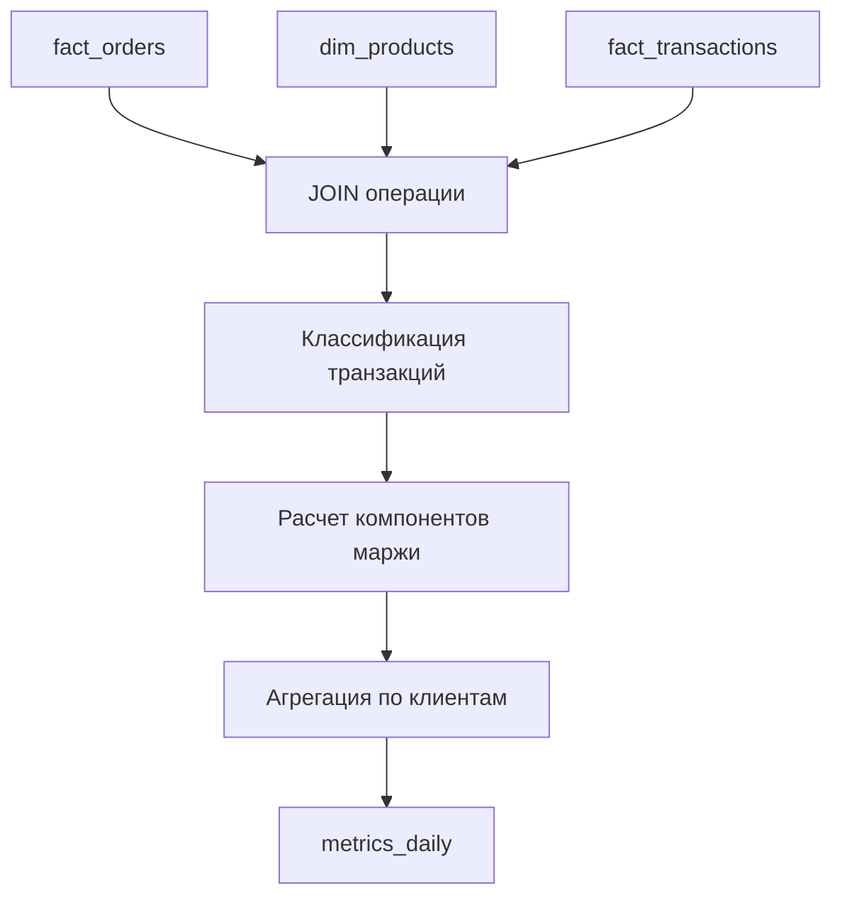

# Руководство по системе расчета маржинальности

**ETL система управления остатками товаров**

---

## 📋 Обзор

Система расчета маржинальности обеспечивает точный расчет чистой прибыли с каждой продажи после вычета всех прямых расходов:

- Себестоимость товаров
- Комиссии маркетплейса
- Расходы на логистику
- Прочие операционные расходы

### Формула расчета маржинальности

```
Маржа = Выручка - Возвраты - Себестоимость - Комиссии - Логистика - Прочие расходы

Процент маржинальности = (Маржа / Выручка) × 100%
```

---

## 🚀 Быстрый старт

### 1. Подготовка базы данных

Выполните миграцию для добавления поддержки расчета маржинальности:

```bash
# На сервере базы данных
mysql -u root -p mi_core_db < add_margin_percent_column.sql
```

Этот скрипт:

- Добавит колонку `margin_percent` в таблицу `metrics_daily`
- Создаст необходимые индексы для оптимизации производительности
- Проверит существующую структуру и безопасно обновит её

### 2. Запуск улучшенной агрегации

```bash
# Запуск агрегации с новым расчетом маржинальности
python3 run_aggregation.py
```

### 3. Проверка результатов

```sql
-- Просмотр результатов расчета маржинальности
SELECT
    metric_date,
    client_id,
    orders_cnt,
    revenue_sum,
    profit_sum,
    margin_percent
FROM metrics_daily
ORDER BY metric_date DESC
LIMIT 10;
```

---

## 📊 Структура данных

### Таблица metrics_daily (обновленная)

| Поле                 | Тип           | Описание                        |
| -------------------- | ------------- | ------------------------------- |
| `client_id`          | INT           | ID клиента                      |
| `metric_date`        | DATE          | Дата метрик                     |
| `orders_cnt`         | INT           | Количество заказов              |
| `revenue_sum`        | DECIMAL(18,4) | Общая выручка                   |
| `returns_sum`        | DECIMAL(18,4) | Сумма возвратов                 |
| `cogs_sum`           | DECIMAL(18,4) | Себестоимость проданных товаров |
| `commission_sum`     | DECIMAL(18,4) | Комиссии маркетплейса           |
| `shipping_sum`       | DECIMAL(18,4) | Расходы на логистику            |
| `other_expenses_sum` | DECIMAL(18,4) | Прочие расходы                  |
| `profit_sum`         | DECIMAL(18,4) | **Чистая прибыль**              |
| `margin_percent`     | DECIMAL(8,4)  | **Процент маржинальности**      |

### Классификация типов транзакций

#### Комиссии (`commission_sum`)

- `комиссия`, `эквайринг`
- `commission`, `fee`
- `OperationMarketplaceServiceItemFulfillment`

#### Логистика (`shipping_sum`)

- `логистика`, `доставка`
- `delivery`, `shipping`
- `OperationMarketplaceServiceItemDeliveryToCustomer`

#### Прочие расходы (`other_expenses_sum`)

- Все остальные расходные операции (amount < 0)
- Исключая возвраты и уже классифицированные типы

---

## 🔧 Техническая реализация

### Основные компоненты

1. **Enhanced SQL Query** (`enhanced_margin_query.sql`)

   - Комплексный запрос с JOIN трех таблиц
   - Классификация типов транзакций
   - Расчет всех компонентов маржинальности

2. **Updated Aggregation Script** (`run_aggregation.py`)

   - Функция `calculate_margin_percentage()`
   - Улучшенная функция `aggregate_daily_metrics()`
   - Детальное логирование результатов

3. **Comprehensive Test Suite**
   - `test_margin_calculation.py` - функциональные тесты
   - `test_margin_performance.py` - тесты производительности
   - `validate_margin_calculations.py` - валидация точности

### Алгоритм работы



---

## 🧪 Тестирование

### Запуск функциональных тестов

```bash
# Полный набор тестов расчета маржинальности
python3 test_margin_calculation.py
```

**Что тестируется:**

- Функция расчета процента маржинальности
- Агрегация на тестовых данных
- Граничные случаи (товары без себестоимости, заказы без транзакций)

### Запуск тестов производительности

```bash
# Тестирование производительности на реальных данных
python3 test_margin_performance.py
```

**Что проверяется:**

- Время выполнения агрегации
- Использование индексов
- Производительность на больших объемах данных

### Валидация точности расчетов

```bash
# Сравнение автоматических расчетов с ручными
python3 validate_margin_calculations.py
```

**Что валидируется:**

- Соответствие автоматических расчетов ручным вычислениям
- Точность классификации транзакций
- Корректность формул расчета

---

## 📈 Мониторинг и отладка

### Проверка корректности данных

```sql
-- 1. Проверка наличия себестоимости у товаров
SELECT
    COUNT(*) as total_products,
    COUNT(cost_price) as products_with_cost,
    ROUND(COUNT(cost_price) * 100.0 / COUNT(*), 2) as cost_coverage_percent
FROM dim_products;

-- 2. Анализ типов транзакций
SELECT
    transaction_type,
    COUNT(*) as count,
    SUM(amount) as total_amount
FROM fact_transactions
WHERE transaction_date >= DATE_SUB(CURDATE(), INTERVAL 7 DAY)
GROUP BY transaction_type
ORDER BY count DESC;

-- 3. Проверка результатов агрегации
SELECT
    metric_date,
    SUM(revenue_sum) as total_revenue,
    SUM(profit_sum) as total_profit,
    ROUND(SUM(profit_sum) * 100.0 / SUM(revenue_sum), 2) as avg_margin_percent
FROM metrics_daily
WHERE metric_date >= DATE_SUB(CURDATE(), INTERVAL 7 DAY)
GROUP BY metric_date
ORDER BY metric_date DESC;
```

### Логирование

Система ведет детальные логи:

- Время выполнения агрегации
- Количество обработанных записей
- Результаты расчетов по каждому клиенту
- Ошибки и предупреждения

Логи сохраняются в стандартный вывод и могут быть перенаправлены в файл:

```bash
python3 run_aggregation.py >> logs/margin_calculation.log 2>&1
```

---

## 🚨 Устранение неполадок

### Частые проблемы и решения

#### 1. Медленная работа агрегации

**Симптомы:** Агрегация выполняется более 10 секунд на дату

**Решение:**

```sql
-- Проверьте наличие индексов
SHOW INDEX FROM fact_orders WHERE Key_name LIKE 'idx_%';
SHOW INDEX FROM fact_transactions WHERE Key_name LIKE 'idx_%';

-- Если индексов нет, выполните:
-- mysql -u root -p mi_core_db < add_margin_percent_column.sql
```

#### 2. Неточные расчеты маржинальности

**Симптомы:** Расхождения между ожидаемыми и фактическими значениями

**Диагностика:**

```bash
# Запустите валидацию
python3 validate_margin_calculations.py

# Проверьте классификацию транзакций
python3 analyze_transaction_types.py
```

#### 3. Отсутствие данных о себестоимости

**Симптомы:** `cogs_sum` всегда равна 0

**Решение:**

```sql
-- Проверьте наличие себестоимости
SELECT COUNT(*) FROM dim_products WHERE cost_price IS NOT NULL;

-- Если данных нет, загрузите их:
-- python3 cost_importer.py
```

#### 4. Ошибки подключения к базе данных

**Симптомы:** `Can't connect to MySQL server`

**Решение:**

```bash
# Проверьте конфигурацию
python3 test_db_connection.py

# Проверьте файл .env
cat .env | grep DB_
```

---

## 📋 Чек-лист развертывания

### Перед развертыванием

- [ ] Создана резервная копия базы данных
- [ ] Проверена конфигурация подключения к БД
- [ ] Убедитесь, что есть данные о себестоимости товаров
- [ ] Проверены права доступа к таблицам

### Развертывание

- [ ] Выполнена миграция схемы БД (`add_margin_percent_column.sql`)
- [ ] Созданы необходимые индексы
- [ ] Обновлен скрипт агрегации (`run_aggregation.py`)
- [ ] Запущены тесты для проверки корректности

### После развертывания

- [ ] Выполнена агрегация для тестовой даты
- [ ] Проверены результаты в таблице `metrics_daily`
- [ ] Запущена валидация расчетов
- [ ] Настроен мониторинг производительности
- [ ] Обновлена документация для пользователей

---

## 🔄 План отката

В случае проблем с новой системой:

### 1. Быстрый откат

```sql
-- Временно отключить новые поля
UPDATE metrics_daily
SET margin_percent = NULL,
    commission_sum = 0,
    shipping_sum = 0,
    other_expenses_sum = 0
WHERE metric_date >= 'YYYY-MM-DD';  -- дата начала проблем
```

### 2. Полный откат

```sql
-- Удалить новую колонку (ОСТОРОЖНО!)
ALTER TABLE metrics_daily DROP COLUMN margin_percent;

-- Восстановить старую версию скрипта агрегации
git checkout HEAD~1 run_aggregation.py
```

### 3. Восстановление из резервной копии

```bash
# Если есть резервная копия
mysql -u root -p mi_core_db < backup_before_margin_update.sql
```

---

## 📞 Поддержка

При возникновении проблем:

1. **Проверьте логи** - большинство проблем описаны в логах выполнения
2. **Запустите тесты** - они помогут локализовать проблему
3. **Проверьте данные** - убедитесь в корректности исходных данных
4. **Обратитесь к разработчику** - с детальным описанием проблемы и логами

---

## 📚 Дополнительные ресурсы

- [Техническая документация ETL системы](README.md)
- [Руководство по импорту себестоимости](COST_IMPORT_GUIDE.md)
- [Руководство по PHP интеграции](PHP_MARGIN_API_GUIDE.md)
- [Руководство по оптимизации производительности](PERFORMANCE_OPTIMIZATION_GUIDE.md)

---

_Документация обновлена: 22 сентября 2025 г._  
_Версия системы: 2.0 (с поддержкой расчета маржинальности)_
