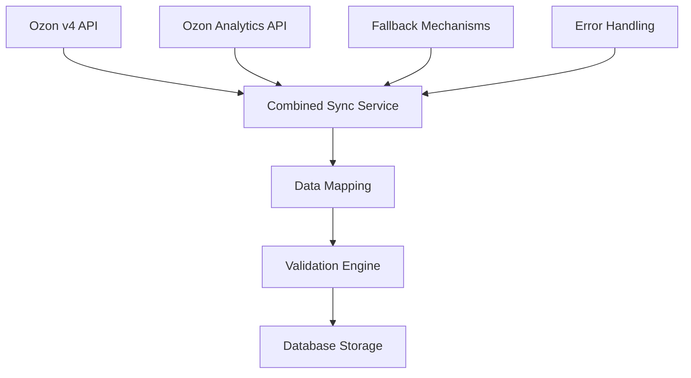

# Ozon v4 API Integration Guide

## Обзор

Данное руководство описывает интеграцию с обновленными API endpoints Ozon для получения остатков товаров. Система использует комбинированный подход, объединяя данные из основного API v4 и аналитического API v2 для получения максимально полной и точной информации об остатках.

## Новые возможности

### 1. Основной API v4 (`POST /v4/product/info/stocks`)

**Улучшения:**

- Корректная обработка структуры данных: `product_id`, `offer_id`, `stocks[]`
- Извлечение SKU из поля `stocks[].sku` вместо устаревших `fbo_sku`/`fbs_sku`
- Поддержка всех типов складов: `fbo`, `fbs`, `realFbs`
- Улучшенная пагинация через `cursor`

**Структура ответа:**

```json
{
  "result": {
    "items": [
      {
        "product_id": 123456789,
        "offer_id": "ABC-123",
        "stocks": [
          {
            "sku": "987654321",
            "warehouse_id": 12345,
            "type": "fbo",
            "present": 15,
            "reserved": 3
          }
        ]
      }
    ],
    "cursor": "next_page_token",
    "total": 1000
  }
}
```

### 2. Аналитический API v2 (`POST /v2/analytics/stock_on_warehouses`)

**Возможности:**

- Детализация по конкретным складам
- Метрики: `free_to_sell_amount`, `promised_amount`, `reserved_amount`
- Привязка к названиям складов
- Поддержка пагинации через `limit`/`offset`

**Структура ответа:**

```json
{
  "result": {
    "data": [
      {
        "dimensions": [
          { "id": "sku", "value": "987654321" },
          { "id": "warehouse", "value": "Москва FBO" }
        ],
        "metrics": [
          { "id": "free_to_sell_amount", "value": 12 },
          { "id": "promised_amount", "value": 15 },
          { "id": "reserved_amount", "value": 3 }
        ]
      }
    ],
    "totals": { "count": 500 }
  }
}
```

## Архитектура решения

### Компоненты системы



### Поток данных

1. **Получение основных остатков** через v4 API
2. **Дополнение аналитическими данными** через Analytics API
3. **Создание маппинга** между источниками данных
4. **Валидация объединенных данных**
5. **Сохранение в БД** с детализацией по складам

## Использование

### Базовая синхронизация

```python
from inventory_sync_service_v4 import InventorySyncServiceV4

service = InventorySyncServiceV4()
service.connect_to_database()

# Синхронизация только основных данных
result = service.sync_ozon_inventory_v4(visibility="VISIBLE")

# Комбинированная синхронизация с аналитикой
result = service.sync_ozon_inventory_combined(
    visibility="VISIBLE",
    include_analytics=True,
    fallback_on_error=True
)

service.close_database_connection()
```

### Получение данных по частям

```python
# Основные остатки с пагинацией
cursor = None
while True:
    result = service.get_ozon_stocks_v4(cursor=cursor, limit=1000)

    # Обработка данных
    stocks = service.process_ozon_v4_stocks(result['items'])

    if not result['has_next']:
        break
    cursor = result['cursor']

# Аналитические данные с пагинацией
all_analytics = service.get_all_ozon_analytics_stocks()
```

### Создание объединенной структуры данных

```python
# Получение данных из обоих источников
main_stocks = service.process_ozon_v4_stocks(main_api_items)
analytics_stocks = service.get_all_ozon_analytics_stocks()

# Создание маппинга
stock_mapping = service.create_stock_mapping(main_stocks, analytics_stocks)

# Единая структура данных
unified_data = service.create_unified_data_structure(
    main_stocks,
    analytics_stocks,
    include_metadata=True
)
```

## Валидация данных

### Обновленная валидация SKU

Система теперь корректно обрабатывает:

- **Числовые SKU** от Ozon (например: `"123456789"`)
- **Буквенно-цифровые SKU** (например: `"ABC-123_DEF"`)
- **Смешанные форматы** (например: `"SKU_456"`)

```python
from inventory_data_validator import InventoryDataValidator

validator = InventoryDataValidator()

# Валидация основных данных
result = validator.validate_inventory_records(records, "Ozon")

# Валидация аналитических данных
analytics_result = validator.validate_analytics_data(analytics_records, "Ozon")

# Валидация объединенных данных
combined_result = validator.validate_combined_stock_data(combined_records, "Ozon")
```

### Новые типы валидации

1. **Валидация аналитических метрик**
2. **Проверка соответствия между API**
3. **Валидация логики складских операций**
4. **Детекция значительных расхождений**

## Обработка ошибок и Fallback

### Стратегии восстановления

```python
# Автоматический fallback при ошибках
recovery_strategy = service.handle_api_unavailability(error, "v4_api")

if recovery_strategy["use_fallback"]:
    # Использование v3 API как fallback
    v3_data = service.get_ozon_stocks_v3()
    v4_data = service._convert_v3_to_v4_format(v3_data['items'])

if recovery_strategy["use_cache"]:
    # Использование кэшированных данных
    cached_data = service.get_cached_stock_data(max_age_hours=24)
```

### Типы ошибок и реакция

| Тип ошибки                | Стратегия        | Действие             |
| ------------------------- | ---------------- | -------------------- |
| `OzonRateLimitError`      | Retry            | Повтор через 5 минут |
| `OzonAuthenticationError` | Skip             | Пропуск API          |
| `OzonServerError`         | Fallback         | Использование v3 API |
| `ConnectionError`         | Fallback + Cache | v3 API + кэш         |

## Структура базы данных

### Основная таблица остатков

```sql
-- Обновленная таблица inventory_data
ALTER TABLE inventory_data
ADD COLUMN warehouse_name VARCHAR(255) DEFAULT 'Main Warehouse',
ADD COLUMN stock_type ENUM('FBO', 'FBS', 'realFBS') DEFAULT 'FBO',
ADD COLUMN quantity_present INT DEFAULT 0,
ADD COLUMN quantity_reserved INT DEFAULT 0,
ADD COLUMN last_sync_at TIMESTAMP DEFAULT CURRENT_TIMESTAMP ON UPDATE CURRENT_TIMESTAMP;
```

### Детализация по складам

```sql
-- Новая таблица для детализации по складам
CREATE TABLE ozon_warehouse_stock_details (
    id INT AUTO_INCREMENT PRIMARY KEY,
    offer_id VARCHAR(255) NOT NULL,
    product_id INT DEFAULT 0,
    warehouse_id INT NOT NULL,
    warehouse_name VARCHAR(255) NOT NULL,
    stock_type VARCHAR(50) DEFAULT 'unknown',
    sku VARCHAR(255) DEFAULT '',
    main_present INT DEFAULT 0,
    main_reserved INT DEFAULT 0,
    analytics_free_to_sell INT DEFAULT 0,
    analytics_promised INT DEFAULT 0,
    analytics_reserved INT DEFAULT 0,
    has_analytics_data BOOLEAN DEFAULT FALSE,
    snapshot_date DATE NOT NULL,
    created_at TIMESTAMP DEFAULT CURRENT_TIMESTAMP,
    UNIQUE KEY unique_offer_warehouse_date (offer_id, warehouse_id, snapshot_date)
);
```

### Сравнения данных

```sql
-- Таблица для анализа расхождений
CREATE TABLE ozon_stock_comparisons (
    id INT AUTO_INCREMENT PRIMARY KEY,
    offer_id VARCHAR(255) NOT NULL,
    warehouse_id INT NOT NULL,
    main_api_present INT DEFAULT 0,
    main_api_reserved INT DEFAULT 0,
    analytics_free_to_sell INT DEFAULT 0,
    analytics_reserved INT DEFAULT 0,
    discrepancy_present INT DEFAULT 0,
    discrepancy_reserved INT DEFAULT 0,
    has_significant_discrepancy BOOLEAN DEFAULT FALSE,
    comparison_date DATE NOT NULL,
    created_at TIMESTAMP DEFAULT CURRENT_TIMESTAMP
);
```

## Мониторинг и алерты

### Метрики для отслеживания

1. **Успешность API запросов**
2. **Время ответа API**
3. **Количество расхождений между источниками**
4. **Процент использования fallback механизмов**

### Алерты

```python
# Генерация алертов при расхождениях
comparisons = service.compare_stock_data(main_stocks, analytics_stocks)
alerts = service.generate_discrepancy_alerts(comparisons)

for alert in alerts:
    if alert['severity'] == 'HIGH':
        # Отправка критического уведомления
        send_critical_alert(alert)
```

## Тестирование

### Запуск тестов

```bash
# Полный набор тестов
python test_inventory_sync_v4.py

# Отдельные компоненты
python -c "from test_inventory_sync_v4 import test_v4_api_connection; test_v4_api_connection()"
```

### Тестовые сценарии

1. **Подключение к v4 API** - проверка новой структуры данных
2. **Аналитический API** - тестирование пагинации и метрик
3. **Валидация данных** - проверка числовых SKU и новых полей
4. **Маппинг данных** - объединение источников
5. **Fallback механизмы** - обработка ошибок API
6. **Комбинированная синхронизация** - полный цикл

## Производительность

### Оптимизации

1. **Пакетная обработка** - до 1000 товаров за запрос
2. **Параллельные запросы** - основной и аналитический API
3. **Кэширование складов** - обновление раз в день
4. **Индексы БД** - для быстрого поиска и сравнения

### Рекомендации

- Используйте `limit=1000` для максимальной эффективности
- Включайте аналитические данные только при необходимости
- Настройте мониторинг rate limits
- Регулярно очищайте старые данные сравнений (>90 дней)

## Миграция с предыдущих версий

### Обновление кода

```python
# Старый способ (v3 API)
result = service.get_ozon_stocks_v3()

# Новый способ (v4 API)
result = service.get_ozon_stocks_v4()

# Комбинированный подход
result = service.sync_ozon_inventory_combined()
```

### Обновление БД

```sql
-- Применение миграций
source migrations/add_v4_api_support.sql
```

## Troubleshooting

### Частые проблемы

1. **Ошибка "cursor expired"** - используйте свежий cursor
2. **Rate limit exceeded** - увеличьте задержки между запросами
3. **Расхождения в данных** - проверьте настройки складов
4. **Пустые аналитические данные** - убедитесь в корректности дат

### Логи и диагностика

```python
# Включение детального логирования
import logging
logging.basicConfig(level=logging.DEBUG)

# Проверка состояния API
service.log_endpoint_usage(endpoint, success, response_time)
```

## Заключение

Обновленная интеграция с Ozon v4 API предоставляет:

- **Более точные данные** благодаря комбинированию источников
- **Лучшую производительность** через оптимизированные запросы
- **Надежность** через fallback механизмы
- **Детальную аналитику** по складам и расхождениям

Система готова к продуктивному использованию и может быть легко расширена для поддержки новых API endpoints.
