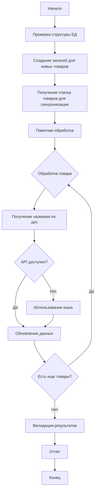

# Руководство по улучшенному скрипту синхронизации (v2.0)

## Обзор

Улучшенная версия скрипта синхронизации реальных названий товаров из Ozon API с исправлениями критических проблем:

- ✅ Исправлены SQL ошибки с DISTINCT и ORDER BY
- ✅ Добавлена обработка ошибок и retry логика
- ✅ Интеграция с таблицей product_cross_reference
- ✅ Использование SafeSyncEngine для надежной синхронизации
- ✅ Прогресс-бар и детальная отчетность
- ✅ Возможность продолжения с места остановки

## Исправленные проблемы

### 1. SQL ошибка "Expression #1 of ORDER BY clause is not in SELECT list"

**Проблема:**

```sql
-- ОШИБКА: ORDER BY колонка не в SELECT
SELECT DISTINCT i.product_id
FROM inventory_data i
ORDER BY i.quantity_present DESC
```

**Решение:**

```sql
-- Используем подзапрос или GROUP BY
SELECT product_id, product_name
FROM (
    SELECT
        i.product_id,
        pcr.cached_name as product_name,
        i.quantity_present
    FROM inventory_data i
    JOIN product_cross_reference pcr ON CAST(i.product_id AS CHAR) = pcr.inventory_product_id
    ORDER BY i.quantity_present DESC
) ranked_products
LIMIT 20
```

### 2. Несовместимость типов данных в JOIN

**Проблема:**

```sql
-- ОШИБКА: INT vs VARCHAR
LEFT JOIN dim_products dp ON i.product_id = dp.sku_ozon
```

**Решение:**

```sql
-- Явное приведение типов
JOIN product_cross_reference pcr ON CAST(i.product_id AS CHAR) = pcr.inventory_product_id
```

### 3. Отсутствие обработки ошибок

**Проблема:**

- Скрипт падал при временных сбоях API
- Не было retry логики
- Отсутствовало детальное логирование

**Решение:**

- Добавлен SyncErrorHandler с retry логикой
- Экспоненциальная задержка между попытками
- Детальное логирование всех операций
- Graceful degradation при недоступности данных

## Использование

### Базовое использование

```bash
# Синхронизация 50 товаров (по умолчанию)
php sync-real-product-names-v2.php

# Синхронизация с указанием лимита
php sync-real-product-names-v2.php --limit=100

# Синхронизация с подробным выводом
php sync-real-product-names-v2.php --limit=100 --verbose

# Изменение размера пакета
php sync-real-product-names-v2.php --limit=1000 --batch-size=20
```

### Параметры командной строки

| Параметр         | Описание                        | По умолчанию |
| ---------------- | ------------------------------- | ------------ |
| `--limit=N`      | Максимальное количество товаров | 50           |
| `--batch-size=N` | Размер пакета для обработки     | 10           |
| `--verbose`      | Подробный вывод (DEBUG логи)    | false        |
| `--help`         | Показать справку                | -            |

### Примеры использования

#### Полная синхронизация всех товаров

```bash
php sync-real-product-names-v2.php --limit=10000 --batch-size=50
```

#### Тестовая синхронизация с подробным выводом

```bash
php sync-real-product-names-v2.php --limit=10 --verbose
```

#### Быстрая синхронизация приоритетных товаров

```bash
php sync-real-product-names-v2.php --limit=100 --batch-size=20
```

## Архитектура

### Компоненты системы

```
sync-real-product-names-v2.php
├── SafeSyncEngine           # Основной движок синхронизации
│   ├── findProductsNeedingSync()
│   ├── processBatch()
│   └── processProduct()
├── SyncErrorHandler         # Обработка ошибок и retry
│   ├── executeWithRetry()
│   ├── shouldRetry()
│   └── calculateRetryDelay()
├── CrossReferenceManager    # Управление cross_reference
│   ├── createOrUpdate()
│   ├── updateCachedName()
│   └── updateSyncStatus()
├── FallbackDataProvider     # Резервные данные
│   ├── getProductName()
│   ├── getCachedName()
│   └── fetchFromOzonAPI()
└── DataTypeNormalizer       # Нормализация типов
    ├── normalizeProduct()
    ├── normalizeId()
    └── compareIds()
```

### Процесс синхронизации



## Таблица product_cross_reference

### Структура

```sql
CREATE TABLE product_cross_reference (
    id BIGINT AUTO_INCREMENT PRIMARY KEY,
    inventory_product_id VARCHAR(50) NOT NULL,
    analytics_product_id VARCHAR(50),
    ozon_product_id VARCHAR(50),
    sku_ozon VARCHAR(50),
    cached_name VARCHAR(500),
    cached_brand VARCHAR(200),
    last_api_sync TIMESTAMP,
    sync_status ENUM('synced', 'pending', 'failed') DEFAULT 'pending',
    created_at TIMESTAMP DEFAULT CURRENT_TIMESTAMP,
    updated_at TIMESTAMP DEFAULT CURRENT_TIMESTAMP ON UPDATE CURRENT_TIMESTAMP,
    INDEX idx_inventory_id (inventory_product_id),
    INDEX idx_ozon_id (ozon_product_id),
    INDEX idx_sku_ozon (sku_ozon)
);
```

### Статусы синхронизации

| Статус    | Описание                |
| --------- | ----------------------- |
| `pending` | Ожидает синхронизации   |
| `synced`  | Успешно синхронизирован |
| `failed`  | Ошибка синхронизации    |

## Обработка ошибок

### Типы ошибок

1. **Временные ошибки** (повторяются автоматически):

   - Timeout
   - Connection errors
   - Rate limiting
   - Deadlock

2. **Критические ошибки** (не повторяются):
   - Authentication errors
   - Invalid credentials
   - Not found
   - Invalid data

### Retry логика

- Максимум 3 попытки по умолчанию
- Экспоненциальная задержка: 1s, 2s, 4s
- Детальное логирование каждой попытки
- Сохранение критических ошибок в БД

### Graceful degradation

При недоступности API:

1. Попытка получить из кэша
2. Использование временного названия
3. Пометка товара для повторной синхронизации

## Логирование

### Уровни логирования

- `DEBUG` - Детальная информация о каждой операции
- `INFO` - Основные события синхронизации
- `WARNING` - Предупреждения и повторные попытки
- `ERROR` - Критические ошибки

### Расположение логов

```
logs/sync_YYYY-MM-DD_HH-MM-SS.log
```

### Пример лога

```
[2025-10-10 15:30:45] [INFO] Starting product names synchronization {"limit":50}
[2025-10-10 15:30:45] [DEBUG] Products query executed {"count":50,"limit":50}
[2025-10-10 15:30:46] [INFO] Processing batch 1/5
[2025-10-10 15:30:47] [WARNING] Attempt 1 failed: Connection timeout
[2025-10-10 15:30:49] [INFO] Operation succeeded on attempt 2
[2025-10-10 15:31:00] [INFO] Synchronization completed {"total":50,"success":48,"failed":2}
```

## Валидация результатов

### Запуск валидации

```bash
php validate_sync_results.php
```

### Проверяемые аспекты

1. ✅ Структура базы данных
2. ✅ Данные в product_cross_reference
3. ✅ Связь с dim_products
4. ✅ Качество названий товаров
5. ✅ Корректность SQL запросов

### Пример отчета

```
🔍 ВАЛИДАЦИЯ РЕЗУЛЬТАТОВ СИНХРОНИЗАЦИИ
======================================

✅ Подключение к БД успешно

📋 Тест 1: Проверка структуры базы данных
   ✅ Таблица product_cross_reference существует
   ✅ Все необходимые колонки присутствуют
   ✅ Структура БД корректна

📋 Тест 2: Проверка данных в product_cross_reference
   Всего записей: 1250
   Синхронизировано: 1180
   С названиями: 1180
   ✅ Найдено 1250 записей

==================================================
📊 ИТОГОВЫЙ ОТЧЕТ
==================================================

✅ Пройдено тестов: 5
❌ Провалено тестов: 0
⚠️  Предупреждений: 0

🎉 ВСЕ ТЕСТЫ ПРОЙДЕНЫ УСПЕШНО!
```

## Мониторинг и метрики

### Статистика синхронизации

```php
$stats = $syncEngine->getSyncStatistics();

// Доступные метрики:
// - total_products: Всего товаров
// - synced: Синхронизировано
// - pending: Ожидает синхронизации
// - failed: Ошибки
// - sync_percentage: Процент синхронизации
// - last_sync_time: Время последней синхронизации
```

### Статистика кэша

```php
$stats = $fallbackProvider->getCacheStatistics();

// Доступные метрики:
// - total_entries: Всего записей
// - cached_names: С кэшированными названиями
// - placeholder_names: С заглушками
// - real_names: С реальными названиями
// - avg_cache_age_hours: Средний возраст кэша
// - cache_hit_rate: Процент попаданий в кэш
```

## Автоматизация

### Настройка cron

```bash
# Ежедневная синхронизация в 3:00
0 3 * * * cd /path/to/project && php sync-real-product-names-v2.php --limit=1000 >> logs/cron_sync.log 2>&1

# Еженедельная полная синхронизация в воскресенье в 2:00
0 2 * * 0 cd /path/to/project && php sync-real-product-names-v2.php --limit=10000 --batch-size=50 >> logs/cron_full_sync.log 2>&1
```

### Мониторинг через скрипт

```bash
#!/bin/bash
# monitor_sync.sh

# Запуск синхронизации
php sync-real-product-names-v2.php --limit=100

# Проверка результатов
if [ $? -eq 0 ]; then
    echo "Синхронизация успешна"
    php validate_sync_results.php
else
    echo "Ошибка синхронизации"
    # Отправка уведомления
    mail -s "Sync Error" admin@example.com < logs/sync_error.log
fi
```

## Устранение неполадок

### Проблема: Скрипт падает с ошибкой памяти

**Решение:**

```bash
# Уменьшите размер пакета
php sync-real-product-names-v2.php --limit=100 --batch-size=5

# Или увеличьте лимит памяти PHP
php -d memory_limit=512M sync-real-product-names-v2.php
```

### Проблема: Медленная синхронизация

**Решение:**

```bash
# Увеличьте размер пакета
php sync-real-product-names-v2.php --limit=1000 --batch-size=50

# Проверьте индексы в БД
mysql -u user -p database < create_product_cross_reference_table.sql
```

### Проблема: Много ошибок API

**Решение:**

1. Проверьте API ключи в config.php
2. Проверьте лимиты API Ozon
3. Увеличьте задержку между запросами
4. Используйте кэш для уменьшения нагрузки на API

### Проблема: Товары не обновляются

**Решение:**

```bash
# Проверьте статус синхронизации
mysql -u user -p -e "SELECT sync_status, COUNT(*) FROM product_cross_reference GROUP BY sync_status"

# Сбросьте статус для повторной синхронизации
mysql -u user -p -e "UPDATE product_cross_reference SET sync_status='pending' WHERE sync_status='failed'"

# Запустите синхронизацию снова
php sync-real-product-names-v2.php --limit=100
```

## Лучшие практики

1. **Регулярная синхронизация**: Настройте cron для ежедневной синхронизации
2. **Мониторинг**: Регулярно проверяйте логи и метрики
3. **Валидация**: Запускайте валидацию после каждой синхронизации
4. **Резервное копирование**: Делайте бэкап БД перед массовыми обновлениями
5. **Постепенное увеличение**: Начните с малых лимитов, постепенно увеличивайте
6. **Очистка кэша**: Периодически очищайте устаревший кэш

## Дополнительные ресурсы

- [Документация SafeSyncEngine](SYNC_ENGINE_GUIDE.md)
- [Руководство по миграциям](../migrations/README.md)
- [API документация Ozon](https://docs.ozon.ru/)
- [Troubleshooting Guide](../TROUBLESHOOTING_GUIDE.md)

## Поддержка

При возникновении проблем:

1. Проверьте логи в директории `logs/`
2. Запустите валидацию: `php validate_sync_results.php`
3. Проверьте документацию по устранению неполадок
4. Создайте issue с детальным описанием проблемы
