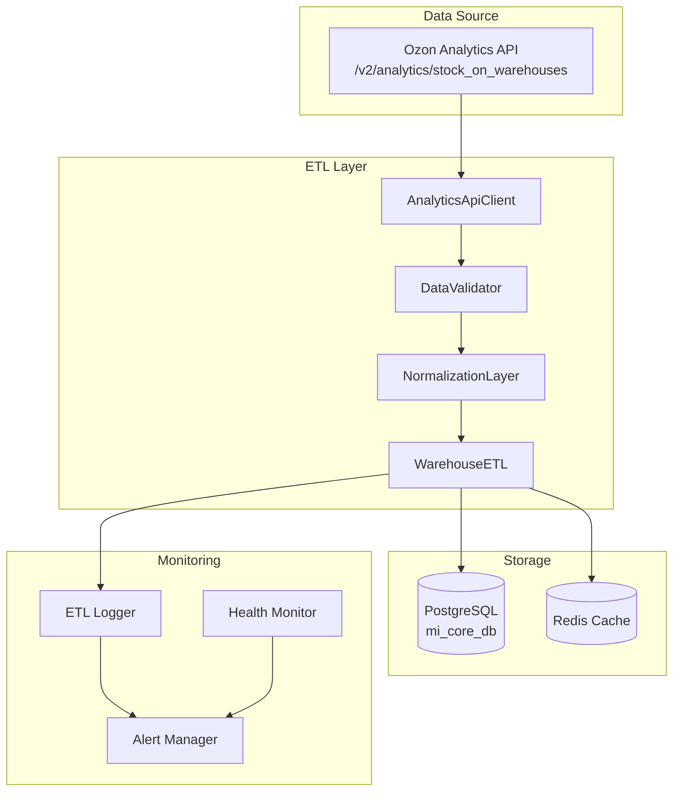

# ETL Architecture Design for Warehouse Multi-Source Integration

## Overview

Based on our analysis, we're designing an ETL architecture that uses **Ozon Analytics API** as the primary (and only needed) data source for warehouse stock information. This architecture will replace the complex multi-source approach with a streamlined Analytics API-first solution.

## Architecture Decision

### ✅ Selected Approach: Analytics API Only

**Rationale:**

-   Analytics API provides all 32 warehouses with complete data
-   Real-time access without report generation delays
-   100% data completeness across all fields
-   No CSV parsing complexity needed
-   Better performance and reliability

### ❌ Rejected Approaches:

-   **Reports API**: Requires warehouse IDs that are not accessible
-   **UI Report Parsing**: Not needed since Analytics API provides better data
-   **Multi-source hybrid**: Unnecessary complexity

## ETL Architecture Components



## Component Specifications

### 1. AnalyticsApiClient

**Purpose:** Handle all communication with Ozon Analytics API

**Key Features:**

-   Pagination support (1000 records per batch)
-   Rate limiting and retry logic
-   Error handling and circuit breaker
-   Request/response logging

```php
class AnalyticsApiClient {
    private string $baseUrl = 'https://api-seller.ozon.ru';
    private string $clientId;
    private string $apiKey;
    private int $maxRetries = 3;
    private int $batchSize = 1000;

    public function getStockOnWarehouses(int $offset = 0, int $limit = 1000): array;
    public function getAllStockData(): Generator;
    private function makeRequest(string $endpoint, array $payload): array;
    private function handleRateLimit(Exception $e): void;
    private function retryWithBackoff(callable $operation, int $maxRetries): mixed;
}
```

### 2. DataValidator

**Purpose:** Validate data quality and detect anomalies

**Validation Rules:**

-   SKU must be positive integer
-   Warehouse name must not be empty
-   Stock amounts must be non-negative
-   Product names must not be empty
-   Detect duplicate records

```php
class DataValidator {
    private array $validationRules;
    private ValidationLogger $logger;

    public function validateRecord(array $record): ValidationResult;
    public function validateBatch(array $records): BatchValidationResult;
    private function checkSkuFormat(mixed $sku): bool;
    private function checkWarehouseName(string $name): bool;
    private function checkStockAmounts(array $record): bool;
    private function detectDuplicates(array $records): array;
}
```

### 3. NormalizationLayer

**Purpose:** Normalize warehouse names and standardize data format

**Normalization Rules:**

```php
$normalizationRules = [
    // Case normalization
    'Санкт_Петербург_РФЦ' => 'САНКТ_ПЕТЕРБУРГ_РФЦ',
    'Новосибирск_РФЦ_НОВЫЙ' => 'НОВОСИБИРСК_РФЦ_НОВЫЙ',
    'Ростов_на_Дону_РФЦ' => 'РОСТОВ_НА_ДОНУ_РФЦ',

    // Standardization
    'Екатеринбург_РФЦ_НОВЫЙ' => 'ЕКАТЕРИНБУРГ_РФЦ_НОВЫЙ',
    'Казань_РФЦ_НОВЫЙ' => 'КАЗАНЬ_РФЦ_НОВЫЙ',

    // Remove extra spaces and standardize separators
    '/\s+/' => '_',
    '/_{2,}/' => '_'
];
```

```php
class NormalizationLayer {
    private array $warehouseMapping;
    private array $normalizationRules;

    public function normalizeRecord(array $record): array;
    public function normalizeWarehouseName(string $name): string;
    private function applyNormalizationRules(string $input): string;
    private function loadWarehouseMapping(): array;
    public function addNormalizationRule(string $original, string $normalized): void;
}
```

### 4. WarehouseETL

**Purpose:** Orchestrate the complete ETL process

**ETL Process Flow:**

1. **Extract**: Fetch data from Analytics API with pagination
2. **Transform**: Validate and normalize data
3. **Load**: Update PostgreSQL inventory table
4. **Audit**: Log all changes and maintain audit trail

```php
class WarehouseETL {
    private AnalyticsApiClient $apiClient;
    private DataValidator $validator;
    private NormalizationLayer $normalizer;
    private DatabaseManager $database;
    private AuditLogger $auditLogger;

    public function performFullSync(): ETLResult;
    public function performIncrementalSync(): ETLResult;
    private function extractData(): Generator;
    private function transformData(array $rawData): array;
    private function loadData(array $transformedData): LoadResult;
    private function updateInventoryTable(array $records): void;
    private function logAuditTrail(array $changes): void;
}
```

## Database Schema Updates

### Enhanced inventory table

```sql
-- Add new fields for multi-source tracking
ALTER TABLE inventory ADD COLUMN IF NOT EXISTS data_source VARCHAR(20) DEFAULT 'analytics_api';
ALTER TABLE inventory ADD COLUMN IF NOT EXISTS data_quality_score INTEGER DEFAULT 100;
ALTER TABLE inventory ADD COLUMN IF NOT EXISTS last_analytics_sync TIMESTAMP WITH TIME ZONE;
ALTER TABLE inventory ADD COLUMN IF NOT EXISTS normalized_warehouse_name VARCHAR(255);
ALTER TABLE inventory ADD COLUMN IF NOT EXISTS original_warehouse_name VARCHAR(255);
ALTER TABLE inventory ADD COLUMN IF NOT EXISTS sync_batch_id UUID;

-- Add indexes for performance
CREATE INDEX IF NOT EXISTS idx_inventory_data_source ON inventory(data_source);
CREATE INDEX IF NOT EXISTS idx_inventory_normalized_warehouse ON inventory(normalized_warehouse_name);
CREATE INDEX IF NOT EXISTS idx_inventory_last_sync ON inventory(last_analytics_sync);
CREATE INDEX IF NOT EXISTS idx_inventory_batch_id ON inventory(sync_batch_id);
```

### New analytics_etl_log table

```sql
CREATE TABLE IF NOT EXISTS analytics_etl_log (
    id SERIAL PRIMARY KEY,

    -- ETL execution metadata
    batch_id UUID NOT NULL,
    etl_type VARCHAR(50) NOT NULL, -- 'full_sync', 'incremental_sync'
    started_at TIMESTAMP WITH TIME ZONE DEFAULT CURRENT_TIMESTAMP,
    completed_at TIMESTAMP WITH TIME ZONE,
    status VARCHAR(20) NOT NULL DEFAULT 'running',

    -- Processing statistics
    records_extracted INTEGER DEFAULT 0,
    records_validated INTEGER DEFAULT 0,
    records_normalized INTEGER DEFAULT 0,
    records_inserted INTEGER DEFAULT 0,
    records_updated INTEGER DEFAULT 0,
    records_failed INTEGER DEFAULT 0,

    -- API statistics
    api_requests_made INTEGER DEFAULT 0,
    api_requests_failed INTEGER DEFAULT 0,
    total_api_time_ms INTEGER DEFAULT 0,

    -- Error information
    error_message TEXT,
    error_details JSONB,

    -- Performance metrics
    execution_time_ms INTEGER,
    memory_used_mb DECIMAL(10,2),

    CONSTRAINT etl_log_valid_status CHECK (
        status IN ('running', 'completed', 'failed', 'cancelled')
    ),
    CONSTRAINT etl_log_valid_type CHECK (
        etl_type IN ('full_sync', 'incremental_sync', 'manual_sync')
    )
);

-- Indexes for monitoring and reporting
CREATE INDEX idx_etl_log_batch_id ON analytics_etl_log(batch_id);
CREATE INDEX idx_etl_log_started_at ON analytics_etl_log(started_at);
CREATE INDEX idx_etl_log_status ON analytics_etl_log(status);
CREATE INDEX idx_etl_log_type ON analytics_etl_log(etl_type);
```

## Data Flow Specification

### Field Mapping

| Analytics API Field   | Target DB Field             | Transformation         | Notes                     |
| --------------------- | --------------------------- | ---------------------- | ------------------------- |
| `sku`                 | `sku`                       | Direct mapping         | Primary key component     |
| `warehouse_name`      | `normalized_warehouse_name` | Normalize              | Apply normalization rules |
| `warehouse_name`      | `original_warehouse_name`   | Direct mapping         | Keep original for audit   |
| `free_to_sell_amount` | `available`                 | Direct mapping         | Available stock           |
| `reserved_amount`     | `reserved`                  | Direct mapping         | Reserved stock            |
| `promised_amount`     | `promised_amount`           | Direct mapping         | New field                 |
| `item_name`           | `product_name`              | Direct mapping         | Product name              |
| `item_code`           | `product_code`              | Direct mapping         | Product code              |
| -                     | `data_source`               | Set to 'analytics_api' | Source tracking           |
| -                     | `data_quality_score`        | Set to 100             | Quality indicator         |
| -                     | `last_analytics_sync`       | Current timestamp      | Sync tracking             |
| -                     | `sync_batch_id`             | Generated UUID         | Batch tracking            |

### ETL Process Steps

#### 1. Extract Phase

```php
// Paginated data extraction
$offset = 0;
$batchSize = 1000;
$allRecords = [];

do {
    $batch = $apiClient->getStockOnWarehouses($offset, $batchSize);
    $records = $batch['result']['rows'] ?? [];

    if (empty($records)) {
        break;
    }

    $allRecords = array_merge($allRecords, $records);
    $offset += $batchSize;

    // Log progress
    $this->logger->info("Extracted batch", [
        'offset' => $offset,
        'batch_size' => count($records),
        'total_extracted' => count($allRecords)
    ]);

} while (count($records) === $batchSize);
```

#### 2. Transform Phase

```php
// Validate and normalize each record
$transformedRecords = [];
$validationErrors = [];

foreach ($allRecords as $record) {
    // Validate record
    $validationResult = $validator->validateRecord($record);

    if (!$validationResult->isValid()) {
        $validationErrors[] = [
            'record' => $record,
            'errors' => $validationResult->getErrors()
        ];
        continue;
    }

    // Normalize record
    $normalizedRecord = $normalizer->normalizeRecord($record);

    // Add metadata
    $normalizedRecord['data_source'] = 'analytics_api';
    $normalizedRecord['data_quality_score'] = 100;
    $normalizedRecord['last_analytics_sync'] = new DateTime();
    $normalizedRecord['sync_batch_id'] = $batchId;

    $transformedRecords[] = $normalizedRecord;
}
```

#### 3. Load Phase

```php
// Batch update inventory table
$database->beginTransaction();

try {
    foreach ($transformedRecords as $record) {
        // Check if record exists
        $existing = $database->findInventoryRecord(
            $record['sku'],
            $record['normalized_warehouse_name']
        );

        if ($existing) {
            // Update existing record
            $changes = $database->updateInventoryRecord($existing['id'], $record);
            $auditLogger->logUpdate($existing, $record, $changes);
        } else {
            // Insert new record
            $newId = $database->insertInventoryRecord($record);
            $auditLogger->logInsert($record, $newId);
        }
    }

    $database->commit();

} catch (Exception $e) {
    $database->rollback();
    throw $e;
}
```

## Scheduling and Automation

### Cron Schedule

```bash
# Full sync twice daily (morning and evening)
0 6,18 * * * /usr/bin/php /path/to/warehouse_etl_analytics.php full-sync

# Incremental sync every 2 hours during business hours
0 8-20/2 * * * /usr/bin/php /path/to/warehouse_etl_analytics.php incremental-sync

# Health check every 15 minutes
*/15 * * * * /usr/bin/php /path/to/warehouse_etl_analytics.php health-check

# Cleanup old logs weekly
0 2 * * 0 /usr/bin/php /path/to/warehouse_etl_analytics.php cleanup-logs
```

### ETL Command Interface

```php
// Command line interface for ETL operations
class ETLCommand {
    public function fullSync(): int;
    public function incrementalSync(): int;
    public function healthCheck(): int;
    public function cleanupLogs(int $daysToKeep = 30): int;
    public function validateData(): int;
    public function showStatus(): int;
}
```

## Monitoring and Alerting

### Key Metrics to Monitor

1. **ETL Performance**

    - Execution time per sync
    - Records processed per minute
    - API response times
    - Memory usage

2. **Data Quality**

    - Validation failure rate
    - Data completeness percentage
    - Duplicate detection rate
    - Normalization success rate

3. **System Health**
    - API availability
    - Database connection status
    - Disk space usage
    - Error rates

### Alert Conditions

```php
$alertRules = [
    'etl_execution_time' => [
        'warning' => 300, // 5 minutes
        'critical' => 600  // 10 minutes
    ],
    'validation_failure_rate' => [
        'warning' => 5,   // 5%
        'critical' => 10  // 10%
    ],
    'api_error_rate' => [
        'warning' => 2,   // 2%
        'critical' => 5   // 5%
    ],
    'data_freshness' => [
        'warning' => 4,   // 4 hours
        'critical' => 8   // 8 hours
    ]
];
```

## Error Handling Strategy

### Retry Logic

```php
class RetryHandler {
    private array $retryableErrors = [
        'ConnectionException',
        'TimeoutException',
        'RateLimitException',
        'TemporaryServerError'
    ];

    private array $backoffDelays = [1, 2, 4, 8, 16]; // seconds

    public function executeWithRetry(callable $operation, int $maxRetries = 3): mixed;
    private function shouldRetry(Exception $e): bool;
    private function calculateBackoff(int $attempt): int;
}
```

### Circuit Breaker

```php
class CircuitBreaker {
    private int $failureThreshold = 5;
    private int $recoveryTimeout = 60; // seconds
    private string $state = 'CLOSED'; // CLOSED, OPEN, HALF_OPEN

    public function call(callable $operation): mixed;
    private function recordSuccess(): void;
    private function recordFailure(): void;
    private function shouldAttemptReset(): bool;
}
```

## Performance Optimization

### Caching Strategy

```php
// Redis caching for API responses
$cacheConfig = [
    'api_response_ttl' => 1800, // 30 minutes
    'warehouse_mapping_ttl' => 86400, // 24 hours
    'validation_rules_ttl' => 3600, // 1 hour
];

// Cache keys
$cacheKeys = [
    'analytics_api_response' => 'warehouse:analytics:response:{offset}:{limit}',
    'warehouse_mapping' => 'warehouse:mapping:normalized',
    'validation_rules' => 'warehouse:validation:rules'
];
```

### Database Optimization

```sql
-- Partitioning for audit tables
CREATE TABLE analytics_etl_log_2025_10 PARTITION OF analytics_etl_log
FOR VALUES FROM ('2025-10-01') TO ('2025-11-01');

-- Indexes for common queries
CREATE INDEX CONCURRENTLY idx_inventory_warehouse_sku
ON inventory(normalized_warehouse_name, sku);

CREATE INDEX CONCURRENTLY idx_inventory_last_sync_desc
ON inventory(last_analytics_sync DESC);
```

## Security Considerations

### API Key Management

```php
// Secure API key storage
class SecureConfig {
    private string $encryptionKey;

    public function getApiKey(): string {
        $encrypted = $_ENV['OZON_API_KEY_ENCRYPTED'];
        return $this->decrypt($encrypted);
    }

    private function decrypt(string $encrypted): string {
        return openssl_decrypt(
            base64_decode($encrypted),
            'AES-256-CBC',
            $this->encryptionKey,
            0,
            substr($this->encryptionKey, 0, 16)
        );
    }
}
```

### Access Control

```php
// Role-based access for ETL operations
$permissions = [
    'etl_admin' => ['full_sync', 'incremental_sync', 'cleanup', 'view_logs'],
    'etl_operator' => ['incremental_sync', 'view_logs'],
    'etl_viewer' => ['view_logs']
];
```

## Testing Strategy

### Unit Tests

```php
class AnalyticsApiClientTest extends TestCase {
    public function testGetStockOnWarehouses(): void;
    public function testPaginationHandling(): void;
    public function testRateLimitHandling(): void;
    public function testErrorRetry(): void;
}

class DataValidatorTest extends TestCase {
    public function testValidRecord(): void;
    public function testInvalidSku(): void;
    public function testEmptyWarehouseName(): void;
    public function testNegativeStock(): void;
}
```

### Integration Tests

```php
class ETLIntegrationTest extends TestCase {
    public function testFullETLProcess(): void;
    public function testDatabaseUpdates(): void;
    public function testAuditTrail(): void;
    public function testErrorRecovery(): void;
}
```

## Deployment Plan

### Phase 1: Core Implementation

1. Create AnalyticsApiClient
2. Implement DataValidator
3. Build NormalizationLayer
4. Create WarehouseETL orchestrator

### Phase 2: Database Integration

1. Apply database schema changes
2. Implement database operations
3. Add audit logging
4. Create ETL command interface

### Phase 3: Monitoring & Automation

1. Add comprehensive logging
2. Implement alerting system
3. Set up cron schedules
4. Create monitoring dashboard

### Phase 4: Testing & Optimization

1. Write comprehensive tests
2. Performance optimization
3. Security hardening
4. Documentation completion

## Success Criteria

-   ✅ ETL processes all 32 warehouses successfully
-   ✅ Data sync completes within 5 minutes for full sync
-   ✅ 99.9% data accuracy (validation pass rate)
-   ✅ Zero data loss during ETL operations
-   ✅ Comprehensive audit trail for all changes
-   ✅ Automated error recovery and alerting
-   ✅ Real-time monitoring and health checks

This architecture provides a robust, scalable, and maintainable solution for warehouse data integration using the Analytics API as the single source of truth.
