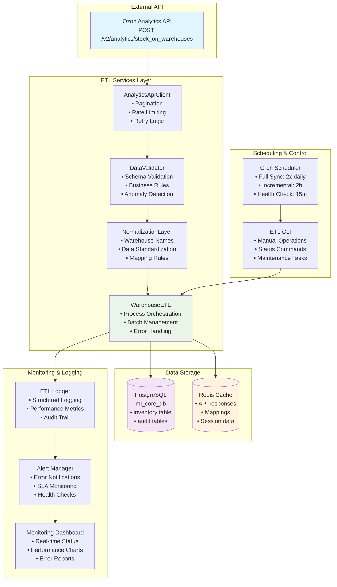
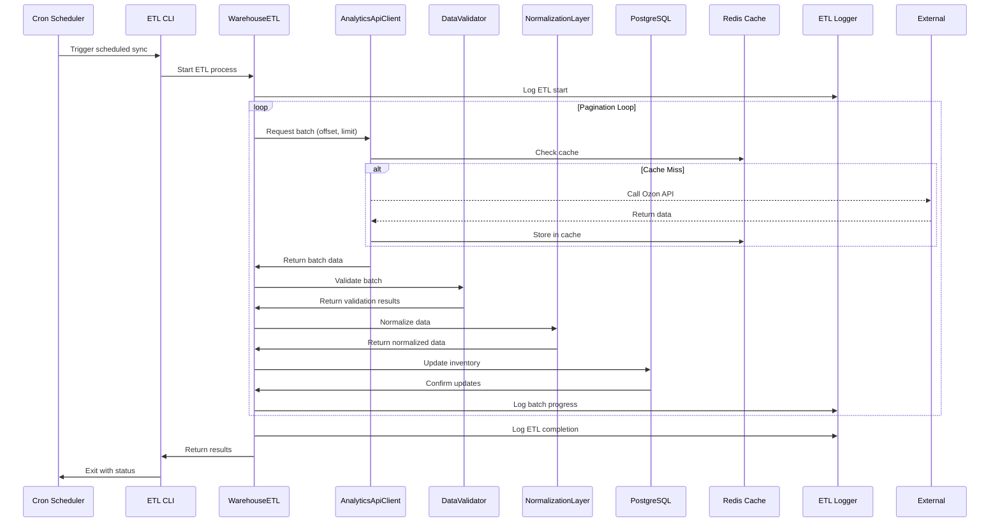
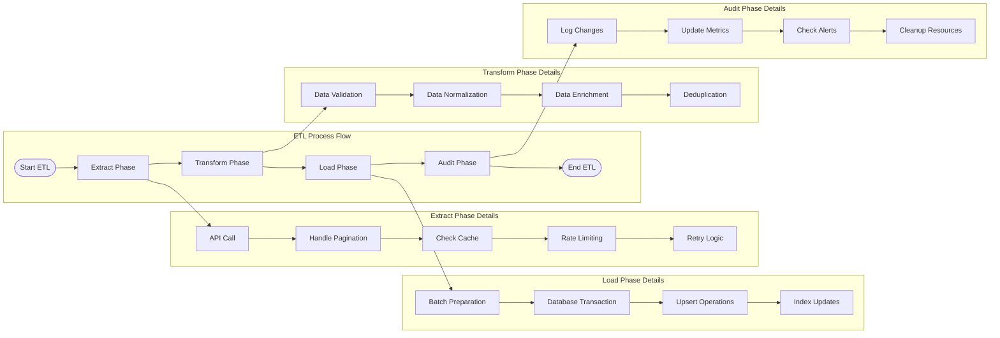
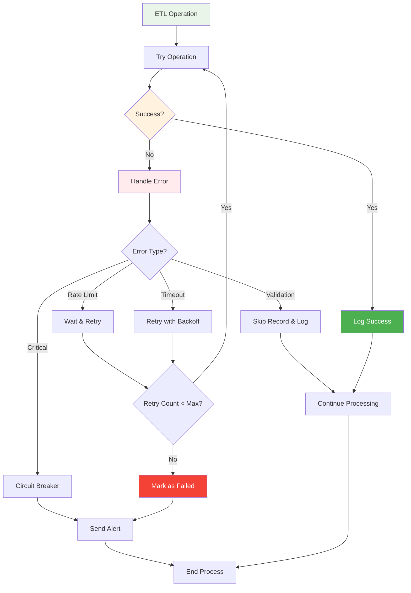
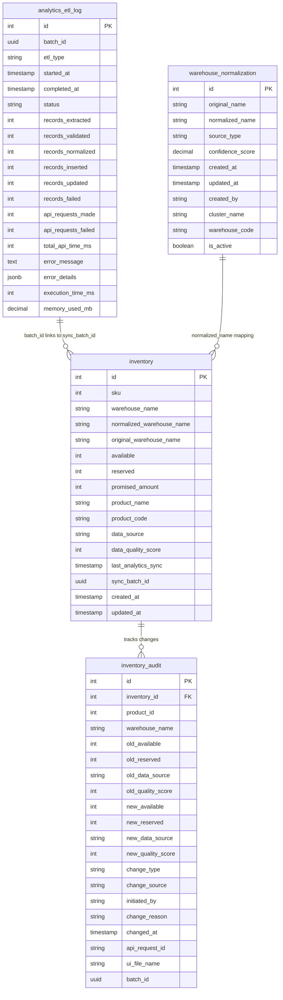
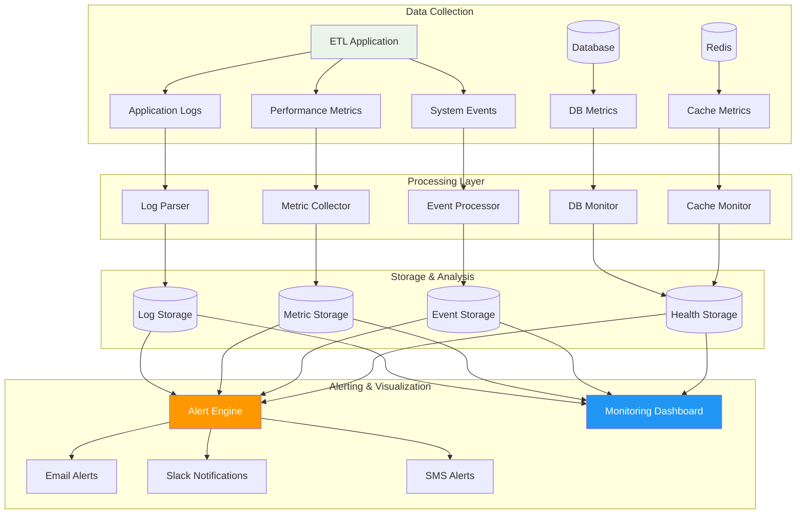
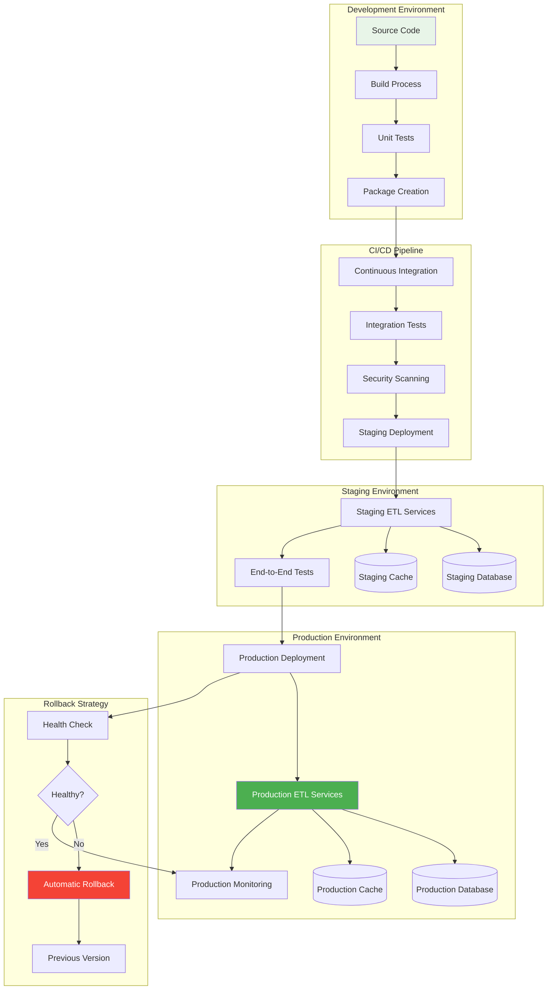

# ETL Architecture Diagrams

## High-Level Architecture

## Data Flow Architecture

## Component Interaction Diagram

## Error Handling Flow

## Database Schema Relationships

## Monitoring Architecture

## Deployment Architecture

These diagrams provide a comprehensive view of the ETL architecture, showing how all components interact and how data flows through the system from the Analytics API to the final storage in PostgreSQL.
