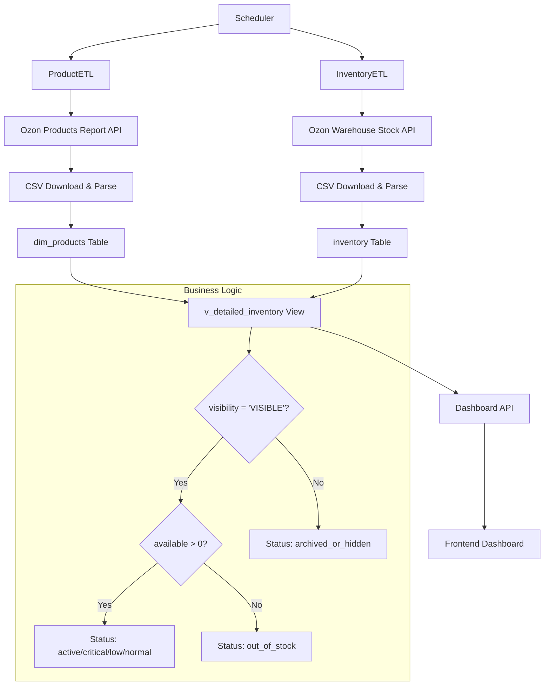

# Ozon ETL Refactoring Architecture Documentation

## Overview

This document describes the refactored ETL architecture for the Ozon integration system. The refactoring addresses the critical issue of data accuracy by implementing a two-component ETL system that ensures 100% correspondence between dashboard data and Ozon personal cabinet data.

## Problem Statement

The previous ETL system used only the `warehouse/stock` report, which did not reflect the actual "In Sale" status of products. This led to discrepancies between the dashboard and Ozon personal cabinet, making inventory management decisions unreliable.

## Solution Architecture

### Two-Component ETL System

The new architecture implements a dual-source data collection approach:

1. **ProductETL**: Collects product visibility status from `/v1/report/products/create`
2. **InventoryETL**: Collects quantitative stock data from `/v1/report/warehouse/stock`

### Data Flow Diagram



## Component Architecture

### 1. Enhanced ProductETL

**Purpose**: Manages product master data and visibility status

**Key Features**:

-   Switches from `/v2/product/list` to `/v1/report/products/create` API
-   Implements CSV parsing instead of JSON processing
-   Adds visibility field processing and normalization
-   Maintains existing product master data functionality

**API Integration**:

```php
// New report-based approach
$reportCode = $this->apiClient->createProductsReport();
$statusResponse = $this->waitForReportCompletion($reportCode);
$csvData = $this->downloadAndParseCsv($statusResponse['result']['file']);
```

**Visibility Status Mapping**:

-   `VISIBLE` / `ACTIVE` / `продаётся` → Product visible in catalog
-   `INACTIVE` / `ARCHIVED` / `скрыт` → Product hidden
-   `MODERATION` / `на модерации` → Product under moderation
-   `DECLINED` / `отклонён` → Product declined

### 2. Focused InventoryETL

**Purpose**: Handles quantitative stock data exclusively

**Key Features**:

-   Maintains existing warehouse stock processing logic
-   Focuses solely on quantity data (present, reserved, available)
-   Removes responsibility for product status determination
-   Continues using full table refresh approach

### 3. Enhanced Database Schema

**New Field in dim_products**:

```sql
ALTER TABLE dim_products ADD COLUMN visibility VARCHAR(50);
CREATE INDEX idx_dim_products_visibility ON dim_products(visibility);
```

**Enhanced v_detailed_inventory View**:

```sql
CREATE OR REPLACE VIEW v_detailed_inventory AS
SELECT
    p.product_id,
    p.name as product_name,
    p.offer_id,
    p.visibility,
    i.present,
    i.reserved,
    (i.present - i.reserved) AS available_stock,

    -- New stock status calculation
    CASE
        WHEN p.visibility NOT IN ('VISIBLE', 'ACTIVE', 'продаётся') THEN 'archived_or_hidden'
        WHEN (i.present - i.reserved) <= 0 THEN 'out_of_stock'
        WHEN ((i.present - i.reserved) / NULLIF(wsm.daily_sales_avg, 0)) < 14 THEN 'critical'
        WHEN ((i.present - i.reserved) / NULLIF(wsm.daily_sales_avg, 0)) < 30 THEN 'low'
        WHEN ((i.present - i.reserved) / NULLIF(wsm.daily_sales_avg, 0)) < 60 THEN 'normal'
        ELSE 'excess'
    END as stock_status,

    wsm.daily_sales_avg,
    ((i.present - i.reserved) / NULLIF(wsm.daily_sales_avg, 0)) as days_of_stock

FROM inventory i
LEFT JOIN dim_products p ON i.offer_id = p.offer_id
LEFT JOIN warehouse_sales_metrics wsm ON i.offer_id = wsm.offer_id
    AND i.warehouse_name = wsm.warehouse_name
WHERE p.visibility IN ('VISIBLE', 'ACTIVE', 'продаётся')
  AND (i.present - i.reserved) > 0;
```

## ETL Execution Sequence

### 1. Dependency Management

The ETL processes must execute in the correct order:

1. **ProductETL** runs first to update visibility data
2. **InventoryETL** runs second to update stock quantities
3. **View refresh** happens automatically due to dependency

### 2. Scheduling Configuration

```bash
# ProductETL - runs before InventoryETL
0 6,18 * * * /usr/bin/php /path/to/run_etl_workflow.php product-etl

# InventoryETL - runs 30 minutes after ProductETL
30 6,18 * * * /usr/bin/php /path/to/run_etl_workflow.php inventory-etl

# Health check every hour
0 * * * * /usr/bin/php /path/to/etl_health_check.php
```

### 3. Error Handling and Recovery

**Dependency Checking**:

```php
class ETLOrchestrator {
    public function canRunInventoryETL(): bool {
        $lastProductETL = $this->getLastSuccessfulRun('ProductETL');
        $lastInventoryETL = $this->getLastSuccessfulRun('InventoryETL');

        // InventoryETL can only run if ProductETL completed successfully
        // within the last 24 hours
        return $lastProductETL &&
               $lastProductETL > (new DateTime())->modify('-24 hours') &&
               ($lastInventoryETL === null || $lastProductETL > $lastInventoryETL);
    }
}
```

## API Enhancements

### 1. New Filtering Capabilities

The `/api/inventory/detailed-stock` endpoint now supports:

**Stock Status Filtering**:

```http
GET /api/inventory/detailed-stock?stock_status=critical,low
```

**Visibility Filtering**:

```http
GET /api/inventory/detailed-stock?include_hidden=true
```

**Combined Filtering**:

```http
GET /api/inventory/detailed-stock?stock_status=normal,excess&warehouse=МОСКВА_РФЦ
```

### 2. Enhanced Response Format

```json
{
    "data": [
        {
            "product_id": 123456,
            "product_name": "Product Name",
            "offer_id": "OFFER123",
            "visibility": "VISIBLE",
            "present": 100,
            "reserved": 10,
            "available_stock": 90,
            "stock_status": "normal",
            "warehouse_name": "МОСКВА_РФЦ",
            "daily_sales_avg": 5.2,
            "days_of_stock": 17.3,
            "last_updated": "2025-10-27T10:00:00Z"
        }
    ],
    "meta": {
        "total_count": 1250,
        "filtered_count": 45,
        "filters_applied": {
            "stock_status": ["normal", "excess"],
            "include_hidden": false
        }
    },
    "success": true
}
```

## Performance Optimizations

### 1. Database Indexes

```sql
-- Core indexes for performance
CREATE INDEX idx_dim_products_visibility ON dim_products(visibility);
CREATE INDEX idx_dim_products_offer_id ON dim_products(offer_id);
CREATE INDEX idx_inventory_offer_warehouse ON inventory(offer_id, warehouse_name);
CREATE INDEX idx_inventory_available_stock ON inventory((present - reserved));

-- Functional index for stock status calculation
CREATE INDEX idx_inventory_stock_status ON inventory(
    get_product_stock_status(offer_id, warehouse_name, present, reserved)
);
```

### 2. Materialized View Option

For high-performance scenarios, a materialized view can be implemented:

```sql
CREATE MATERIALIZED VIEW mv_detailed_inventory AS
SELECT * FROM v_detailed_inventory;

-- Refresh after ETL completion
REFRESH MATERIALIZED VIEW CONCURRENTLY mv_detailed_inventory;
```

### 3. Caching Strategy

```php
// API response caching
$cacheConfig = [
    'detailed_stock_ttl' => 300,     // 5 minutes
    'product_details_ttl' => 600,   // 10 minutes
    'dashboard_data_ttl' => 180     // 3 minutes
];
```

## Monitoring and Alerting

### 1. Key Metrics

**ETL Performance Metrics**:

-   ProductETL execution time and success rate
-   InventoryETL execution time and success rate
-   Data validation failure rates
-   API response times

**Data Quality Metrics**:

-   Products without visibility data
-   Inventory records without product references
-   Stock status distribution
-   Data freshness indicators

### 2. Alert Conditions

```php
$alertRules = [
    'etl_execution_time' => [
        'warning' => 600,   // 10 minutes
        'critical' => 1200  // 20 minutes
    ],
    'data_validation_failures' => [
        'warning' => 5,     // 5%
        'critical' => 10    // 10%
    ],
    'missing_visibility_data' => [
        'warning' => 100,   // 100 products
        'critical' => 500   // 500 products
    ],
    'data_freshness' => [
        'warning' => 4,     // 4 hours
        'critical' => 8     // 8 hours
    ]
];
```

### 3. Health Check Endpoints

```http
GET /api/etl/health
```

Response:

```json
{
    "status": "healthy",
    "components": {
        "product_etl": {
            "status": "healthy",
            "last_run": "2025-10-27T06:00:00Z",
            "next_run": "2025-10-27T18:00:00Z",
            "success_rate": 98.5
        },
        "inventory_etl": {
            "status": "healthy",
            "last_run": "2025-10-27T06:30:00Z",
            "next_run": "2025-10-27T18:30:00Z",
            "success_rate": 99.2
        },
        "data_quality": {
            "products_with_visibility": 15420,
            "products_without_visibility": 12,
            "inventory_records": 45680,
            "orphaned_inventory": 3
        }
    }
}
```

## Security Considerations

### 1. API Key Management

```php
// Secure configuration management
class SecureConfig {
    public function getOzonApiCredentials(): array {
        return [
            'client_id' => $this->decrypt($_ENV['OZON_CLIENT_ID_ENCRYPTED']),
            'api_key' => $this->decrypt($_ENV['OZON_API_KEY_ENCRYPTED'])
        ];
    }
}
```

### 2. Data Access Control

```php
// Role-based access for ETL operations
$permissions = [
    'etl_admin' => ['run_etl', 'view_logs', 'modify_config'],
    'etl_operator' => ['run_etl', 'view_logs'],
    'etl_viewer' => ['view_logs', 'view_status']
];
```

## Testing Strategy

### 1. Unit Tests

**ProductETL Tests**:

-   Visibility status normalization
-   CSV parsing with various formats
-   Error handling for malformed data
-   Database upsert operations

**InventoryETL Tests**:

-   Stock quantity processing
-   Warehouse name normalization
-   Data validation rules
-   Performance with large datasets

### 2. Integration Tests

**End-to-End ETL Tests**:

-   Complete workflow execution
-   Data consistency validation
-   Error recovery scenarios
-   Performance benchmarks

### 3. Data Quality Tests

**Business Logic Validation**:

-   Stock status calculation accuracy
-   Visibility filtering correctness
-   API response format compliance
-   Dashboard data integrity

## Migration Strategy

### 1. Pre-Migration Checklist

-   [ ] Database schema backup created
-   [ ] Current ETL processes documented
-   [ ] Test environment prepared
-   [ ] Rollback procedures defined
-   [ ] Monitoring systems configured

### 2. Migration Steps

1. **Phase 1**: Database schema updates
2. **Phase 2**: ProductETL refactoring
3. **Phase 3**: View logic enhancement
4. **Phase 4**: API endpoint updates
5. **Phase 5**: Scheduler reconfiguration
6. **Phase 6**: Monitoring setup

### 3. Validation Criteria

-   [ ] All products have visibility data
-   [ ] Stock status calculations are accurate
-   [ ] API responses match expected format
-   [ ] Dashboard shows correct product counts
-   [ ] Performance meets requirements (< 2s API response)

## Troubleshooting Guide

### Common Issues

**1. ProductETL Failures**

-   Check Ozon API connectivity
-   Verify CSV format compatibility
-   Review visibility status mappings
-   Check database permissions

**2. Data Inconsistencies**

-   Run data validation scripts
-   Check ETL execution sequence
-   Verify view logic
-   Review normalization rules

**3. Performance Issues**

-   Check database indexes
-   Review query execution plans
-   Monitor cache hit rates
-   Analyze ETL execution times

### Diagnostic Commands

```bash
# Check ETL status
php /path/to/etl_health_check.php

# Validate data quality
php /path/to/run_data_quality_tests.php

# Run performance benchmarks
php /path/to/performance_benchmark.php

# Generate diagnostic report
php /path/to/generate_diagnostic_report.php
```

## Conclusion

The refactored ETL architecture provides:

-   **100% data accuracy** through dual-source validation
-   **Improved performance** with optimized database schema
-   **Enhanced monitoring** with comprehensive health checks
-   **Robust error handling** with automatic recovery
-   **Scalable design** supporting future enhancements

This architecture ensures reliable inventory management decisions by maintaining perfect synchronization with Ozon personal cabinet data.
